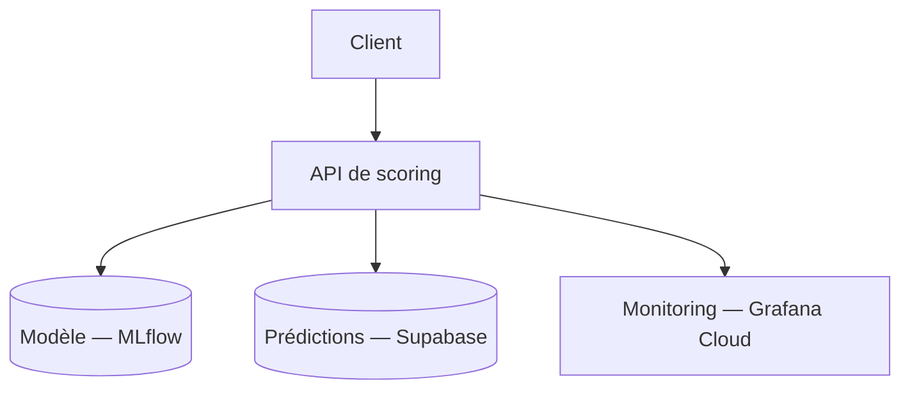

<a id="readme-top"></a>

<!-- PROJECT LOGO -->
<br />
<div align="center">

<h3 align="center">Credit Scoring API</h3>

  <p align="center">
    Déploiement d'un modèle de scoring crédit pour "Prêt à Dépenser" : une API FastAPI, PostgreSQL/Supabase, une démo Gradio, un monitoring Grafana/Prometheus et un pipeline CI/CD complet.
    <br />
    <a href="https://lefevrk.github.io/OC-Confirmez-vos-competences-en-MLOps/"><strong>Explore the docs »</strong></a>
    <br />
    <br />
    <a href="https://credit-scoring.lefevrek.fr/">View Demo</a>
    &middot;
    <a href="https://github.com/lefevrk/OC-Confirmez-vos-competences-en-MLOps/issues/new?labels=bug&template=bug_report.md">Report Bug</a>
    &middot;
    <a href="https://github.com/lefevrk/OC-Confirmez-vos-competences-en-MLOps/issues/new?labels=enhancement&template=feature_request.md">Request Feature</a>
  </p>

  [](https://github.com/lefevrk/OC-Confirmez-vos-competences-en-MLOps/actions/workflows/ci-cd.yml)
  [](https://github.com/lefevrk/OC-Confirmez-vos-competences-en-MLOps/actions/workflows/docs.yml)
</div>

<!-- TABLE OF CONTENTS -->
<details>
  <summary>Table of Contents</summary>
  <ol>
    <li><a href="#about-the-project">About The Project</a></li>
    <li>
      <a href="#getting-started">Getting Started</a>
      <ul>
        <li><a href="#prerequisites">Prerequisites</a></li>
        <li><a href="#docker-installation">Docker Installation</a></li>
        <li><a href="#installation-without-docker">Installation (without Docker)</a></li>
      </ul>
    </li>
    <li><a href="#usage">Usage</a></li>
    <li><a href="#key-results">Key Results</a></li>
    <li><a href="#roadmap">Roadmap</a></li>
    <li><a href="#acknowledgments">Acknowledgments</a></li>
  </ol>
</details>

<!-- ABOUT THE PROJECT -->
## About The Project

Ce dépôt déploie en production un modèle de scoring crédit pour **"Prêt à Dépenser"** : une API qui prend en entrée le dossier d'un client (50 features) et retourne un score de risque et une recommandation de décision (accepté/refusé). Le modèle lui-même (feature engineering, entraînement, registre MLflow) vit dans un dépôt séparé — celui-ci est le dépôt de **déploiement**.



### Context

Un modèle de scoring qui dérive silencieusement sur des données réelles peut continuer à répondre sans jamais signaler qu'il devient moins pertinent. Ce projet répond à ce besoin avec un service d'inférence conteneurisé, une persistance systématique de chaque prédiction, une observabilité complète et une détection automatique de dérive des données.

### What it does

- **Sert des prédictions** via une API FastAPI avec documentation OpenAPI/Swagger complète (résumés, codes d'erreur, exemples)
- **Valide strictement chaque entrée** via des schémas Pydantic à 50 champs, bornes auditées contre le jeu d'entraînement
- **Persiste chaque prédiction** dans PostgreSQL/Supabase pour la traçabilité et l'analyse de dérive
- **Observe en continu** — métriques Prometheus, logs structurés JSON, dashboards Grafana
- **Détecte la dérive des données** automatiquement (Evidently AI), sans intervention manuelle
- **Automatise tout le cycle de vie** via 5 workflows GitHub Actions (qualité, build, déploiement, drift, documentation)
- **Expose une démo Gradio** pour tester le modèle sans écrire de code

### Built With

<ul>
  <li> <strong>Python 3.12</strong> — langage principal</li>
  <li> <strong>FastAPI & Pydantic</strong> — API et validation</li>
  <li> <strong>PostgreSQL (Supabase) & SQLAlchemy</strong> — persistance</li>
  <li> <strong>MLflow</strong> — registre de modèles</li>
  <li> <strong>LightGBM & Scikit-Learn</strong> — modèle de scoring</li>
  <li> <strong>Gradio</strong> — démo interactive</li>
  <li> <strong>Evidently AI</strong> — détection de dérive des données</li>
  <li> <strong>Grafana Cloud, Prometheus & Loki (Alloy)</strong> — monitoring</li>
  <li> <strong>Docker</strong> — conteneurisation</li>
  <li> <strong>GitHub Actions</strong> — CI/CD</li>
</ul>

<p align="right">(<a href="#readme-top">back to top</a>)</p>

<!-- GETTING STARTED -->
## Getting Started

### Prerequisites

- [Docker](https://www.docker.com/) et Docker Compose — façon recommandée de lancer le projet
- Un accès à un serveur MLflow (registre de modèles, hors périmètre de ce dépôt)
- [Python 3.12+](https://www.python.org/downloads/) et [uv](https://docs.astral.sh/uv/getting-started/installation/) — uniquement pour un lancement sans Docker
- Une base PostgreSQL accessible et migrée — uniquement pour un lancement sans Docker (`make docker-run` la fournit)

### Docker Installation

Façon recommandée de lancer le projet : démarre l'API, PostgreSQL et toute la stack de monitoring locale (Prometheus, Loki, Alloy, Grafana) en une commande.

1. Cloner le dépôt et configurer les variables d'environnement
   ```bash
   git clone https://github.com/lefevrk/OC-Confirmez-vos-competences-en-MLOps.git
   cd OC-Confirmez-vos-competences-en-MLOps
   cp .env.example .env
   ```
   Détail de chaque variable (MLflow, PostgreSQL...) : [Installation & configuration](https://lefevrk.github.io/OC-Confirmez-vos-competences-en-MLOps/getting-started/configuration/).

2. Lancer (build, migration puis démarrage de la stack complète)
   ```bash
   make docker-run
   ```

L'API écoute sur `http://localhost:8000` — Swagger sur `/docs`, démo Gradio sur `/`, Grafana local sur `http://localhost:3000`.

### Installation (without Docker)

Suppose une base PostgreSQL déjà lancée et migrée (`docker compose up -d postgres && make db-migrate`, ou une instance existante) et les variables d'environnement déjà configurées.

```bash
make requirements
make db-migrate
make run
```

L'API écoute sur `http://localhost:8000`, sans la stack de monitoring locale.

<p align="right">(<a href="#readme-top">back to top</a>)</p>

<!-- USAGE EXAMPLES -->
## Usage

Documentation interactive complète (schémas exacts, essai en direct) sur `GET /docs`. Aucune authentification n'est requise sur `/predictions` — voir [Sécurité](https://lefevrk.github.io/OC-Confirmez-vos-competences-en-MLOps/design/security/) pour ce choix assumé.

### Scorer un dossier client

```bash
curl -X POST http://localhost:8000/predictions \
     -H "Content-Type: application/json" \
     -d @payload.json
```

Les 50 champs attendus (types, bornes, valeurs optionnelles) : [Scoring](https://lefevrk.github.io/OC-Confirmez-vos-competences-en-MLOps/design/api/scoring/#post-predictions).

### Vérifier l'état du service

```bash
curl http://localhost:8000/ready
```

<p align="right">(<a href="#readme-top">back to top</a>)</p>

## Key Results

- ROC-AUC 0.78, recall 0.65 sur le jeu de test — détail dans [Modèle de scoring](https://lefevrk.github.io/OC-Confirmez-vos-competences-en-MLOps/design/model/).
- 88 tests, 100 % de couverture, pipeline CI/CD entièrement automatisé (5 workflows GitHub Actions) — détail dans [Tests & qualité](https://lefevrk.github.io/OC-Confirmez-vos-competences-en-MLOps/operations/testing/).
- Détection de drift automatisée (Evidently AI), sans intervention manuelle.

<!-- ACKNOWLEDGMENTS -->
## Acknowledgments

Projet réalisé par **Kilian LEFEVRE** dans le cadre du parcours OpenClassrooms AI Engineer — Projet 8 : *Confirmez vos compétences en MLOps* (Partie 2/2).

<p align="right">(<a href="#readme-top">back to top</a>)</p>
