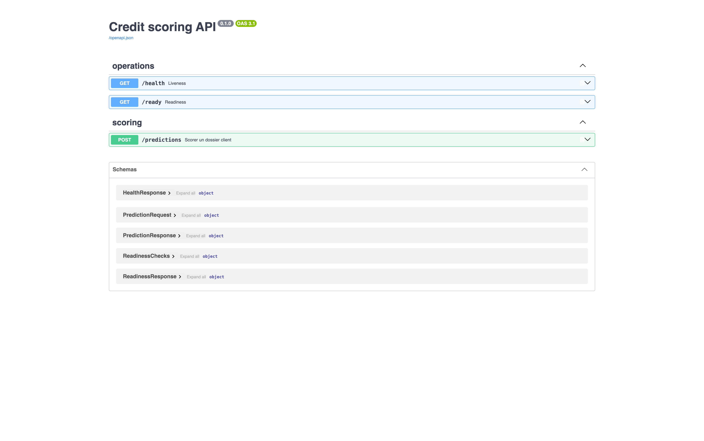

# Référence API

Documentation interactive complète (schémas exacts, essai en direct) sur `GET /docs` (Swagger UI, généré automatiquement par FastAPI) — capture ci-dessous. Ces pages donnent la vue d'ensemble et les détails que Swagger n'explique pas : auth, sémantique des codes de statut, exemples, diagrammes. FastAPI a été choisi pour ça : la validation typée via Pydantic est ce qui rend praticable un contrat à 50 champs contraints ([Scoring](scoring.md#post-predictions)) sans les revalider à la main, et la doc Swagger en découle automatiquement plutôt que d'être maintenue à part.

-   __Scoring__

    ---

    `POST /predictions` — le seul endpoint métier : champs, réponse, codes de statut, diagrammes du calcul d'une prédiction.

    → [Scoring](scoring.md)

-   __Health & readiness__

    ---

    `GET /health`, `/ready`, `/metrics` — liveness, readiness des dépendances, métriques Prometheus.

    → [Health & readiness](health.md)

-   __Monitoring__

    ---

    `GET /evidently` — le rapport de drift le plus récent.

    → [Monitoring](monitoring.md)

*Ce qu'on voit : la liste des endpoints générée automatiquement par FastAPI (`GET /docs`). Ce que ça prouve : le contrat HTTP réellement exposé correspond aux pages ci-dessous. Capturé en local (`make docker-run`), 26/08/2026.*

## Vue d'ensemble

| Méthode | Chemin | Auth | Rôle |
|---|---|---|---|
| `GET` | `/health` | aucune | Liveness — le process tourne |
| `GET` | `/ready` | aucune | Readiness — modèle et base de données disponibles |
| `GET` | `/metrics` | aucune | Métriques Prometheus |
| `POST` | `/predictions` | aucune | Scorer un dossier client |
| `GET` | `/evidently` | Basic (`API_TOKEN`) | Dernier rapport de drift généré |
| `GET` | `/` | aucune | UI de démo (Gradio) |

`/predictions` et `/` sont volontairement ouverts — voir [Sécurité](../security.md#authentification) pour le compromis assumé. Toutes les routes sauf `/` sont enregistrées avant le montage de la démo Gradio et restent donc prioritaires sur son catch-all (voir [Architecture](../architecture.md)).
