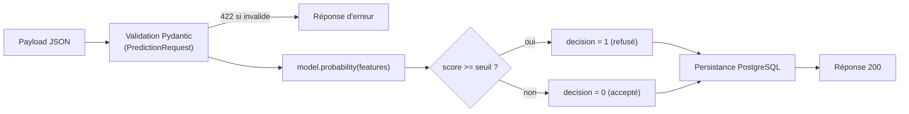
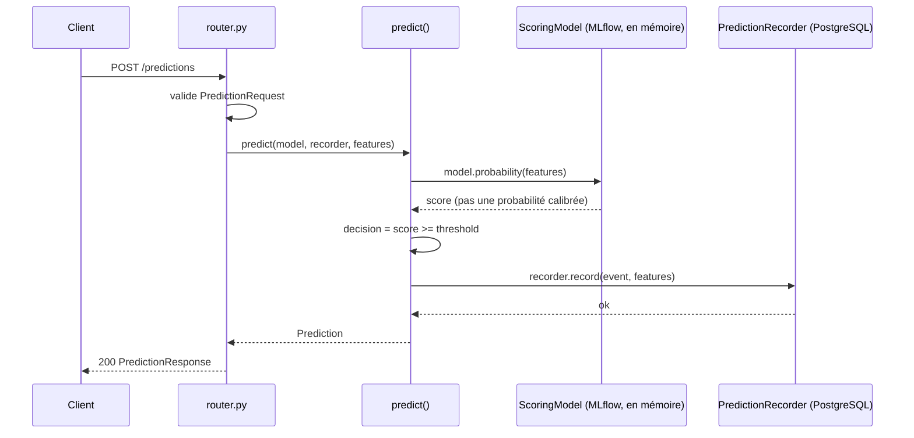

# Scoring

## `POST /predictions`

Le seul endpoint métier, et le seul avec de la logique applicative propre — voir [Architecture](../architecture.md#le-pattern-module-par-module). Aucune authentification requise (voir [Sécurité](../security.md#authentification)).

**Requête** — 50 champs correspondant aux features du modèle (`PredictionRequest`, `src/api/modules/scoring/presentation/schemas.py`), en respectant strictement les alias attendus (`extra="forbid"` : un champ inconnu est rejeté).

???+ note "Les 50 champs (cliquer pour déplier)"

    | Champ | Type | Obligatoire | Contrainte |
    |---|---|---|---|
    | `payment_credit_ratio` | nombre | non | >= 0 |
    | `EXT_SOURCE_2` | nombre | non | >= 0, <= 1 |
    | `EXT_SOURCE_1` | nombre | non | >= 0, <= 1 |
    | `EXT_SOURCE_3` | nombre | non | >= 0, <= 1 |
    | `DAYS_BIRTH` | entier | **oui** | <= 0 |
    | `AMT_ANNUITY` | nombre | non | > 0 |
    | `ORGANIZATION_TYPE` | énumération | **oui** | — |
    | `previous_approved_cnt_payment_mean` | nombre | non | >= 0 |
    | `DAYS_EMPLOYED` | nombre | non | <= 0 |
    | `DAYS_ID_PUBLISH` | entier | **oui** | <= 0 |
    | `annuity_income_ratio` | nombre | non | >= 0 |
    | `previous_cnt_payment_mean` | nombre | non | >= 0 |
    | `bureau_active_days_credit_max` | nombre | non | <= 0 |
    | `installment_days_past_due_mean` | nombre | non | >= 0 |
    | `AMT_CREDIT` | nombre | **oui** | > 0 |
    | `installment_amt_payment_sum` | nombre | non | >= 0 |
    | `income_credit_ratio` | nombre | **oui** | >= 0 |
    | `bureau_days_credit_max` | nombre | non | <= 0 |
    | `DAYS_REGISTRATION` | nombre | **oui** | <= 0 |
    | `bureau_closed_days_credit_max` | nombre | non | <= 0 |
    | `AMT_GOODS_PRICE` | nombre | non | > 0 |
    | `CODE_GENDER` | énumération (`F`, `M`, `XNA`) | **oui** | — |
    | `bureau_active_days_credit_enddate_min` | nombre | non | — |
    | `installment_days_before_due_sum` | nombre | non | >= 0 |
    | `installment_days_entry_payment_max` | nombre | non | <= 0 |
    | `pos_months_balance_size` | nombre | non | >= 0 |
    | `installment_payment_difference_mean` | nombre | non | — |
    | `credit_card_cnt_drawings_atm_current_mean` | nombre | non | >= 0 |
    | `employment_birth_ratio` | nombre | non | >= 0 |
    | `previous_days_decision_mean` | nombre | non | <= 0 |
    | `bureau_active_amt_credit_sum_sum` | nombre | non | >= 0 |
    | `OCCUPATION_TYPE` | énumération | **oui** | — |
    | `installment_days_before_due_max` | nombre | non | >= 0 |
    | `installment_days_entry_payment_mean` | nombre | non | <= 0 |
    | `previous_application_credit_ratio_mean` | nombre | non | >= 0 |
    | `previous_approved_days_decision_max` | nombre | non | <= 0 |
    | `NAME_FAMILY_STATUS` | énumération | **oui** | — |
    | `bureau_closed_days_credit_update_mean` | nombre | non | <= 0 |
    | `bureau_days_credit_enddate_max` | nombre | non | — |
    | `previous_approved_cnt_payment_sum` | nombre | non | >= 0 |
    | `bureau_active_amt_credit_max_overdue_mean` | nombre | non | >= 0 |
    | `bureau_amt_credit_max_overdue_mean` | nombre | non | >= 0 |
    | `installment_amt_instalment_sum` | nombre | non | >= 0 |
    | `installment_days_entry_payment_sum` | nombre | non | <= 0 |
    | `pos_sk_dpd_def_mean` | nombre | non | >= 0 |
    | `NAME_EDUCATION_TYPE` | énumération | **oui** | — |
    | `bureau_amt_credit_sum_sum` | nombre | non | >= 0 |
    | `installment_amt_instalment_max` | nombre | non | >= 0 |
    | `bureau_active_amt_credit_sum_mean` | nombre | non | >= 0 |
    | `bureau_active_days_credit_update_mean` | nombre | non | — |

    Les bornes et le caractère obligatoire de chaque champ sont audités contre le jeu d'entraînement (307 511 lignes) : un champ est optionnel si le jeu d'entraînement contient effectivement des valeurs manquantes pour lui, et borné seulement si les données ne montrent aucune exception au signe attendu. Voir la docstring de `PredictionRequest` pour le détail de cette méthode.

**Réponse** (`200`) :

```json
{
  "prediction_id": "b3c1...-uuid",
  "probability": 0.341,
  "decision": 0,
  "model_version": "4"
}
```

`model_version` reflète la version du champion réellement chargé au démarrage — elle change quand un nouveau champion est promu (voir [Modèle de scoring](../model.md) pour la version actuelle).

`probability` **n'est pas une probabilité calibrée** : le modèle est un classifieur binaire géré pour le déséquilibre des classes, ce score sert uniquement à positionner la prédiction par rapport au seuil de décision du modèle (lui-même chargé depuis MLflow, voir [Architecture](../architecture.md#composition-au-demarrage)). `decision` vaut `1` si `probability >= seuil` (dossier refusé), `0` sinon (accepté) — détail du calcul plus bas.

**Codes de statut :**

| Code | Cas |
|---|---|
| `200` | Prédiction réalisée |
| `422` | Payload invalide (champ manquant, hors borne, type incorrect, champ inconnu) |
| `500` | Erreur inattendue du modèle, ou probabilité hors `[0, 1]` (`InvalidProbabilityError`) |
| `503` | Modèle ou base de données indisponibles (échec au démarrage) |

**Exemple :**

```bash
curl -X POST http://localhost:8000/predictions \
  -H "Content-Type: application/json" \
  -d @payload.json
```

## Comment une prédiction est calculée



## Le flux d'une prédiction

Vue code (composants internes), complémentaire de la [vue cloud](../architecture.md#vue-cloud-le-chemin-dune-prediction) qui montre le chemin à travers les services externes :



Le modèle et le recorder sont chargés une seule fois au démarrage (`bootstrap.py`) et réutilisés pour chaque requête — jamais rechargés à la volée.
