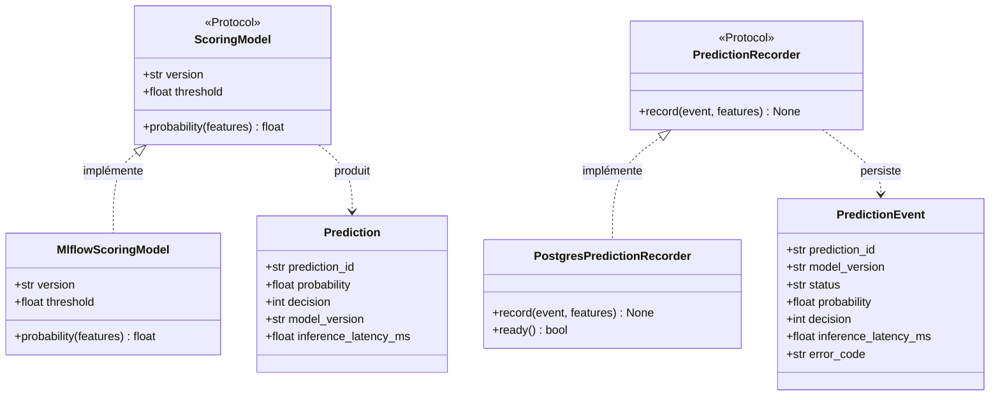
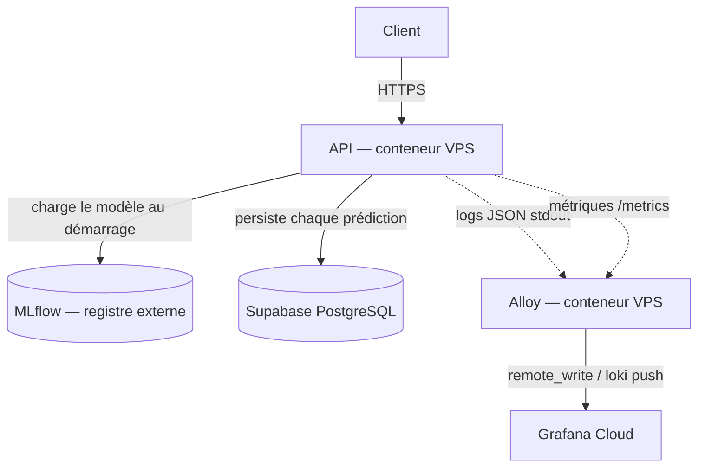
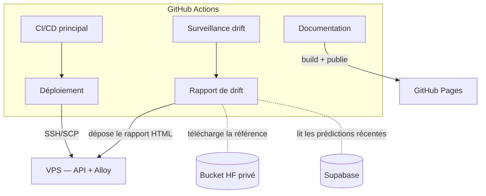

# Architecture

L'API suit une architecture hexagonale (ports & adaptateurs) : la logique métier ne dépend d'aucun framework, et tout ce qui touche à l'extérieur (HTTP, MLflow, PostgreSQL) est un adaptateur remplaçable. Deux vues complémentaires ci-dessous : d'abord l'application elle-même (comment le code est découpé, et pourquoi), puis comment cette application s'inscrit parmi les services cloud et l'orchestration qui l'entourent.

## Arborescence et pourquoi ce découpage

Le use case de scoring (`predict()`) ne dépend d'aucun framework — testable avec de simples doubles, remplaçable indépendamment de FastAPI/MLflow/PostgreSQL. C'est ce que l'arborescence ci-dessous et le pattern module par module qui suit mettent en œuvre concrètement :

```text
src/api/
├── app.py                          # assemblage FastAPI (routes, middleware, exception handlers)
├── bootstrap.py                    # composition root : charge modèle + connexion DB au démarrage
├── common/
│   └── error_handling.py           # base commune pour mapper une erreur domaine -> HTTP
├── infra/                          # adaptateurs génériques (pas de logique métier)
│   ├── auth.py                     # vérification Basic (GET /evidently)
│   ├── config.py                   # Settings (pydantic-settings)
│   ├── logging.py                  # sink JSON structuré (Loguru)
│   ├── metrics.py                  # métriques Prometheus
│   ├── mlflow_model.py             # adaptateur MLflow -> ScoringModel
│   ├── observability_middleware.py # métriques HTTP par requête
│   └── postgres/
│       ├── models.py                # schéma SQLAlchemy
│       └── tracking.py              # adaptateur PostgreSQL -> PredictionRecorder
└── modules/
    ├── scoring/                    # le seul module avec de la logique métier propre
    │   ├── domain/
    │   │   ├── entities.py         # Prediction, PredictionEvent (dataclasses gelées)
    │   │   └── errors.py           # ScoringError, InvalidProbabilityError
    │   ├── ports/
    │   │   ├── model.py             # Protocol ScoringModel
    │   │   └── prediction_recorder.py  # Protocol PredictionRecorder
    │   ├── services/
    │   │   └── predict.py           # le use case : predict(model, recorder, features)
    │   └── presentation/
    │       ├── router.py            # POST /predictions
    │       ├── schemas.py           # PredictionRequest/Response (Pydantic)
    │       └── error_handler.py     # ScoringError -> code HTTP
    ├── health/                      # /health, /ready, /metrics — pas de domaine propre
    │   ├── router.py
    │   └── schemas.py
    └── monitoring/                  # /evidently — sert le rapport de drift généré en CI
        └── router.py

src/ui/                              # démo Gradio — package séparé, pas sous api/modules/
├── blocks.py                        # formulaire + appelle POST /predictions en HTTP
└── sample_data/
    └── demo_samples.csv             # échantillon réel pour le bouton "Charger un exemple"
```

## Le pattern, module par module

`scoring` est le seul module avec les quatre couches complètes, parce que c'est le seul avec de la vraie logique métier à protéger :

- **`domain/`** ne dépend de rien — `entities.py` définit `Prediction` et `PredictionEvent` comme de simples dataclasses gelées, `errors.py` une petite hiérarchie d'exceptions.
- **`ports/`** décrit ce dont le use case a besoin, sans dire comment — `ScoringModel` et `PredictionRecorder` sont des `Protocol` : n'importe quel objet qui a la bonne forme convient, sans héritage explicite.
- **`services/predict.py`** est le use case : il prend un `ScoringModel`, un `PredictionRecorder` et un dict de features, applique le seuil de décision, et renvoie une `Prediction`. Il n'importe ni FastAPI, ni MLflow, ni SQLAlchemy — testable avec de simples doubles de test (voir `tests/unit/scoring/test_services.py`).
- **`presentation/router.py`** est la seule couche qui parle HTTP : elle valide l'entrée (`PredictionRequest`), résout le modèle et le recorder déjà chargés au démarrage, appelle `predict()`, et traduit le résultat en réponse HTTP.

`health` et `monitoring` n'ont pas de couche `presentation/` séparée : ce sont des adaptateurs purs, sans logique métier à eux. `health` expose l'état du process et les métriques Prometheus ; `monitoring` sert un fichier HTML généré ailleurs (voir [Analyse du drift](../operations/drift-analysis.md)). `src/ui/` (la démo Gradio) n'est même pas un module de l'API : c'est un package séparé qui construit une UI et appelle `POST /predictions` en HTTP, exactement comme n'importe quel autre client — l'API reste la seule frontière de validation, la logique de `scoring` n'est jamais dupliquée côté UI (voir [Démo Gradio](../operations/demo.md)).

## Diagramme de classes

Les entités du domaine (`entities.py`) et les ports (`ports/`) — les adaptateurs concrets (`MlflowScoringModel`, `PostgresPredictionRecorder`) satisfont les `Protocol` par leur forme, sans en hériter explicitement. Les erreurs domaine (`errors.py`) sont omises ici pour rester lisible — voir `src/api/modules/scoring/domain/errors.py` directement :



## Composition au démarrage

`bootstrap.py` est le *composition root* : au lancement de l'application (`lifespan()`), il charge le modèle champion depuis MLflow et ouvre la connexion PostgreSQL, puis les stocke sur `app.state`. C'est la seule étape qui construit les adaptateurs concrets (`MlflowScoringModel`, `PostgresPredictionRecorder`) — le reste du code ne connaît que les ports (`ScoringModel`, `PredictionRecorder`, voir le diagramme de classes plus haut). Le modèle et le recorder sont chargés une seule fois, à ce moment-là, et réutilisés pour chaque requête — jamais rechargés à la volée.

Le détail pas-à-pas d'une requête `POST /predictions` (routeur → use case → modèle → persistance) est documenté avec le reste de l'endpoint : [Scoring](api/scoring.md#le-flux-dune-prediction).

## Vue cloud — le chemin d'une prédiction

L'application ci-dessus ne tourne pas seule : un utilisateur qui l'appelle traverse plusieurs services externes réels ; ce diagramme montre le chemin complet, pas seulement le code (voir [Scoring](api/scoring.md#le-flux-dune-prediction) pour la vue code, séquence par séquence) :



`deploy/compose.yml` publie directement le port de l'API (`HOST_PORT`) sur le VPS — aucun reverse proxy n'est géré par ce dépôt. En pratique, le VPS personnel utilisé pour héberger `release`/`production` fait déjà tourner Caddy pour d'autres applications qui y sont déployées ; ce Caddy existant a été pointé vers `HOST_PORT` pour exposer l'API en HTTPS sur un domaine public (c'est ce qui rend légitime la valeur `SCORING_API_URL=https://...` attendue en production, voir [Installation & configuration](../getting-started/configuration.md)). Sa configuration elle-même (le `Caddyfile`) n'est pas versionnée dans ce dépôt — c'est un réglage du VPS, pas de ce projet.

## Vue orchestration — GitHub Actions

Distinct du diagramme ci-dessus : celui-ci montre l'automatisation (CI/CD, drift, documentation), pas le chemin d'une requête utilisateur. Une fois déployée, l'application parle directement à MLflow/Supabase/Grafana Cloud au runtime (diagramme précédent) — GitHub Actions ne s'interpose jamais dans ce chemin, il orchestre uniquement le déploiement et les jobs périodiques :



Détail de chaque workflow (et à quel fichier `.github/workflows/*.yml` chaque nom correspond) : [CI/CD & déploiement](../operations/deployment.md).

## Services cloud utilisés

| Service | Rôle | Connecté par | Configuration |
|---|---|---|---|
| MLflow | Registre de modèles (champion chargé au démarrage) | l'API, au runtime | externe, hors périmètre de ce dépôt |
| Supabase (PostgreSQL) | Persistance des prédictions | l'API (écriture), le rapport de drift (lecture) | [Configurer Supabase](../getting-started/services/supabase.md) |
| Grafana Cloud | Stockage métriques/logs (Prometheus/Loki) | Alloy, au runtime | [Configurer Grafana Cloud](../getting-started/services/grafana-cloud.md) |
| Bucket Hugging Face | Jeu de référence pour le drift | le rapport de drift uniquement | [Configurer le bucket Hugging Face](../getting-started/services/huggingface-bucket.md) |
| GitHub Actions | Orchestrateur central (CI/CD, drift, docs) | — | [CI/CD & déploiement](../operations/deployment.md) |
| GitHub Pages | Hébergement de ce site | `docs.yml` | [CI/CD & déploiement](../operations/deployment.md) |
