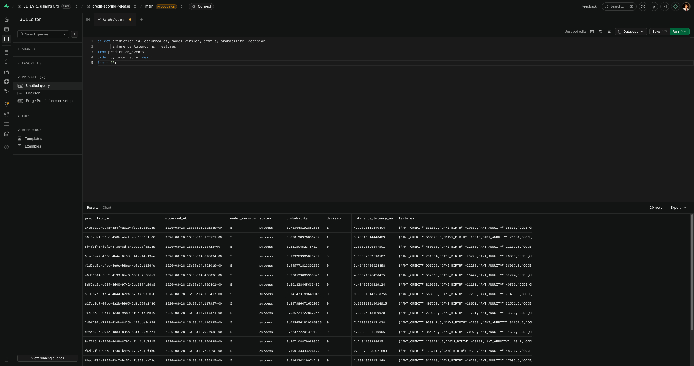
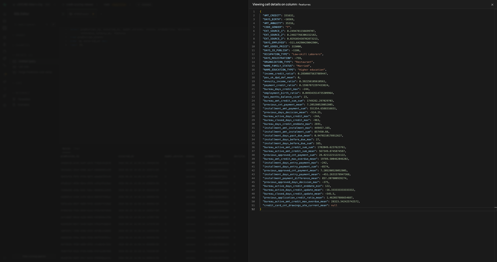

# Stockage des données de production

Chaque appel à `POST /predictions` est journalisé dans PostgreSQL (Supabase en release/production, voir [Configurer Supabase](../getting-started/services/supabase.md)) — pas seulement les succès : `services/predict.py` persiste aussi les échecs, avec le code d'erreur, pour garder une trace complète du trafic réel (entrée, sortie, temps d'exécution), condition nécessaire à l'analyse de drift ([Analyse du drift](../operations/drift-analysis.md)) et au diagnostic d'incident.

## Schéma — `prediction_events`

Une ligne par tentative de scoring, définie dans `src/api/infra/postgres/models.py` (migration Alembic : `migrations/versions/f9a0166a98f4_create_prediction_events.py`) :

| Colonne | Type | Rôle |
|---|---|---|
| `id` | `bigint` (PK) | identifiant technique auto-incrémenté |
| `prediction_id` | `varchar(36)` | UUID généré par `predict()`, aussi renvoyé au client — permet de relier une réponse HTTP à sa ligne |
| `occurred_at` | `timestamptz`, indexé | horodatage serveur (`server_default=now()`) |
| `model_name` / `model_alias` / `model_version` | `varchar` | quel modèle a scoré cette ligne (`model_version` indexé — utile pour isoler le trafic d'une version après une promotion) |
| `status` | `varchar(16)` | `success` ou `error` |
| `error_code` | `varchar(128)`, nullable | nom de l'exception si `status = error` (ex. `InvalidProbabilityError`) |
| `probability` | `float`, nullable | score prédit — `null` seulement si le modèle n'a jamais répondu |
| `decision` | `int`, nullable | 0 (accepté) / 1 (refusé) |
| `inference_latency_ms` | `float`, nullable | temps du seul appel `model.probability()`, pas de la requête HTTP entière (voir [Monitoring & métriques](../operations/monitoring.md)) |
| `features` | `jsonb` | le payload complet des 50 features, tel que reçu — utilisé tel quel comme donnée d'entrée pour le drift |

`probability`/`decision`/`inference_latency_ms` restent `null` sur une ligne en erreur : le modèle n'a jamais renvoyé de valeur à enregistrer (voir [Architecture](architecture.md#diagramme-de-classes), `PredictionEvent`).

## Pourquoi PostgreSQL plutôt que MangoDB

La table est mixte plus que documentaire : huit colonnes typées et indexées (`occurred_at`, `model_version`, `status`, `probability`...) pour une seule colonne réellement semi-structurée (`features`). Le JSONB donne la flexibilité "document" là où elle sert — un payload dont le schéma dépend du modèle, pas du code de l'API — sans sacrifier typage, contraintes et index sur le reste ; un store type MongoDB aurait imposé cette flexibilité à toute la table pour un gain nul ici, puisque `features` n'est jamais interrogé champ par champ, seulement relu en bloc pour le drift. Deux avantages concrets déjà exploités le confirment : la purge de rétention tourne en `pg_cron`, un job SQL planifié directement dans la base sans infrastructure supplémentaire, et l'analyse de drift lit directement via `pandas.read_sql` sans couche de traduction document → tabulaire.

## Écriture

`PostgresPredictionRecorder.record()` (`src/api/infra/postgres/tracking.py`) ouvre une session SQLAlchemy, insère la ligne et commit — timeouts de connexion (5s) et de statement (3s) volontairement courts pour qu'une base lente ou injoignable fasse échouer une requête plutôt que de la faire attendre indéfiniment.

## Preuve en conditions réelles

Requête directe dans le SQL Editor Supabase (projet `credit-scoring-release`), sur les 20 dernières lignes réelles :

```sql
select prediction_id, occurred_at, model_version, status, probability, decision,
       inference_latency_ms, features
from prediction_events
order by occurred_at desc
limit 20;
```



*20 lignes réelles, toutes `status = success` — l'API sert déjà du trafic en `release` et chaque appel est bien journalisé, entrée et sortie comprises.*

Détail d'une cellule `features` (clic sur la cellule dans Supabase) — le payload JSONB complet tel que reçu par l'API, 50 clés :


