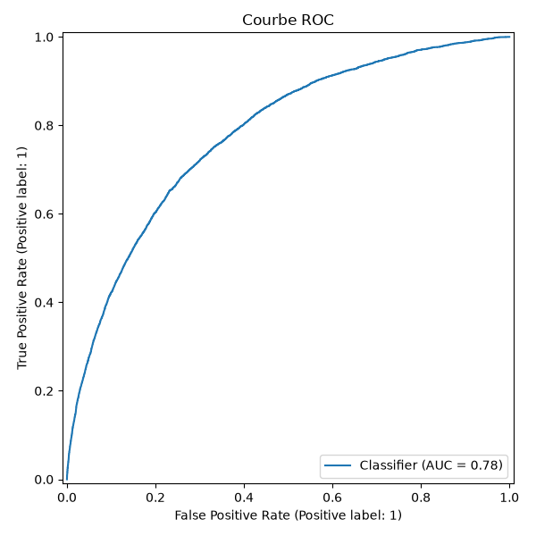
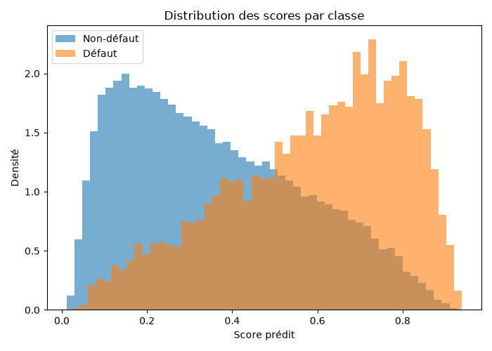
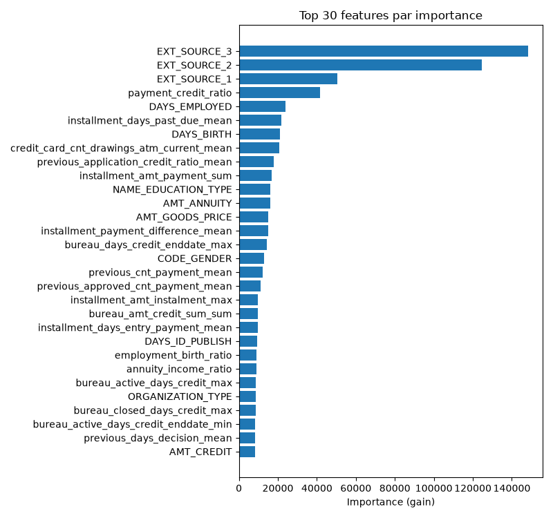

# Modèle de scoring

Ce dépôt ne fait pas l'entraînement du modèle — c'est le dépôt de **déploiement** (voir [Accueil](../index.md)). Cette page documente le champion résolu depuis le registre MLflow externe au démarrage (`src/api/infra/mlflow_model.py`) : registre `credit_scoring`, alias `champion`, **version 4**, run `reduced-feature-finetuning-scale-pos-weight` (`8c5fbb02458f4fe3af0df07975e10621`), régénérée le 2026-08-27. Tenue à jour automatiquement — à chaque push touchant la doc, et sur demande (`workflow_dispatch`, voir [CI/CD & déploiement](../operations/deployment.md)).

<div class="grid cards" markdown>

-   __ROC-AUC__

    ---

    ### 0.78

    discrimination globale

-   __Recall__

    ---

    ### 0.65

    des défauts réels détectés

-   __Seuil de décision__

    ---

    ### 0.53

    refus si `probability >= 0.53`

-   __Version__

    ---

    ### v4

    alias `champion`

</div>

## Contrat métier

- `decision = 1` signifie **refusé**, `decision = 0` signifie **accepté** — un score au-dessus du seuil (0.53) refuse le dossier.
- Ce score est une **recommandation**, pas une décision d'octroi finale au sens réglementaire : voir les limites déjà posées sur la [page d'accueil](../index.md#contexte).
- L'API ne modélise aucun circuit d'approbation ou de contestation humaine — s'il existe, il est externe à ce dépôt.

!!! info "Pourquoi le score n'est pas une probabilité calibrée"
    Le modèle est entraîné avec `scale_pos_weight=11.3871`, qui rééquilibre artificiellement la fonction de perte pour compenser le déséquilibre de classes (la classe "défaut" est minoritaire dans les données d'entraînement). Ce rééquilibrage déplace mécaniquement la distribution des scores de sortie loin d'une vraie probabilité calibrée — c'est la cause technique concrète de la remarque déjà faite dans [Scoring](api/scoring.md#post-predictions) : `probability` n'est pas une probabilité de défaut au sens statistique, seulement un score utilisé pour trancher par rapport à un seuil.

## Performance

=== "Métriques (jeu de test)"

    | Métrique | Valeur | Note |
    |---|---|---|
    | ROC-AUC | 0.7804 | discrimination globale |
    | PR-AUC (average precision) | 0.2687 | plus pertinente que le ROC-AUC vu le déséquilibre de classes |
    | Precision | 0.1977 |  |
    | Recall | 0.6528 |  |
    | F1 | 0.3035 |  |
    | Log loss | 0.5256 |  |
    | Brier score | 0.1766 |  |
    | Coût métier | 0.4942 | fonction de coût définie dans le dépôt d'entraînement (pas documentée ici) |
    | Temps d'inférence | 1.7138 ms | mesuré côté entraînement |

=== "Hyperparamètres"

    | Paramètre | Valeur |
    |---|---|
    | `scale_pos_weight` | **11.3871** |
    | `n_estimators` | **170** |
    | `learning_rate` | **0.0804** |
    | `num_leaves` | **31** |
    | `min_child_samples` | **40** |
    | `subsample` | **0.8** |
    | `colsample_bytree` | **0.7** |
    | `reg_lambda` | **0.0108** |

## Courbe ROC



## Distribution des scores



Les deux classes se chevauchent largement — attendu pour un problème aussi déséquilibré.

## Feature importance



Les 3 scores de solvabilité externe (`EXT_SOURCE_1/2/3`) dominent généralement ce type de jeu de données — voir le graphique ci-dessus pour le classement exact de cette version.

## Traçabilité et rafraîchissement

??? note "Comment cette page est générée, et comment la régénérer"
    Cette page n'est pas écrite à la main : `scripts/generate_model_docs.py` interroge l'API REST du serveur MLflow (`MLFLOW_TRACKING_URI`, Basic Auth) pour résoudre le champion `credit_scoring`/`champion`, en tire les métriques/hyperparamètres du run et télécharge ses 3 graphiques, puis réécrit ce fichier. Exécuté automatiquement avant chaque build du site (`.github/workflows/docs.yml`), jamais commité — voir [CI/CD & déploiement](../operations/deployment.md).

    ```bash
    MLFLOW_TRACKING_URI=... MLFLOW_TRACKING_USERNAME=... MLFLOW_TRACKING_PASSWORD=... \
        uv run python scripts/generate_model_docs.py
    ```
