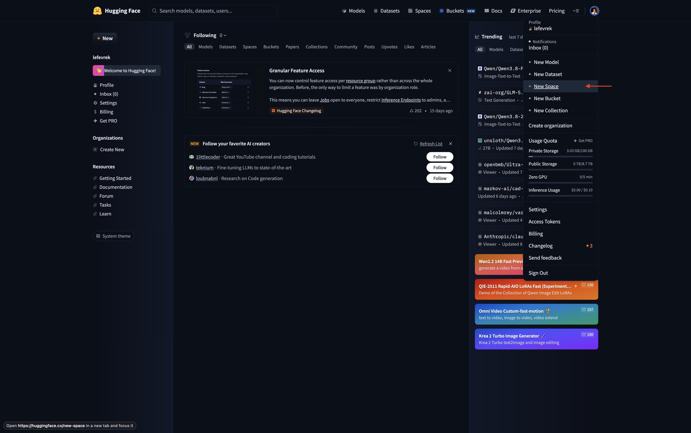
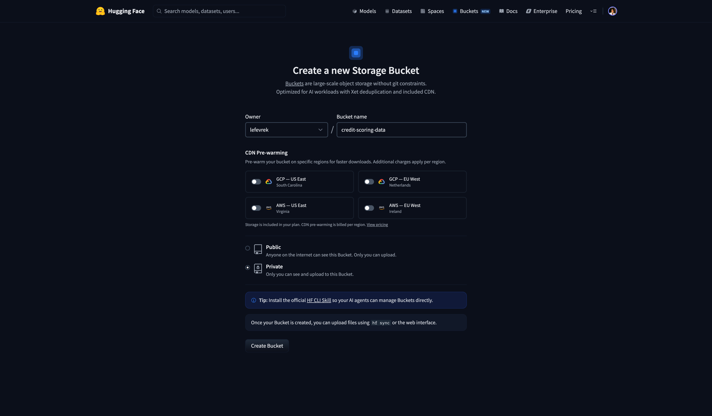
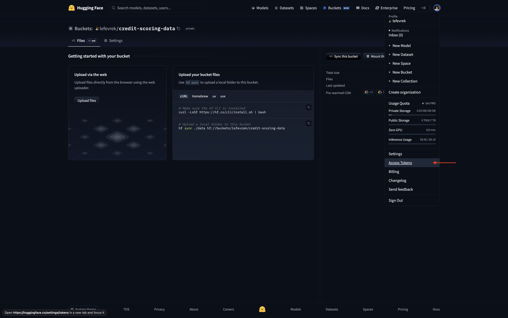
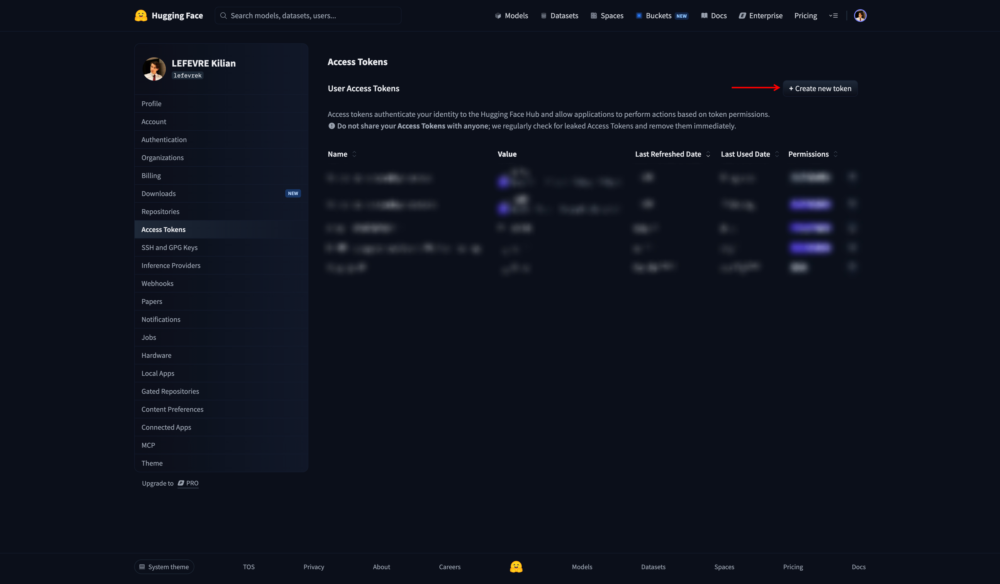
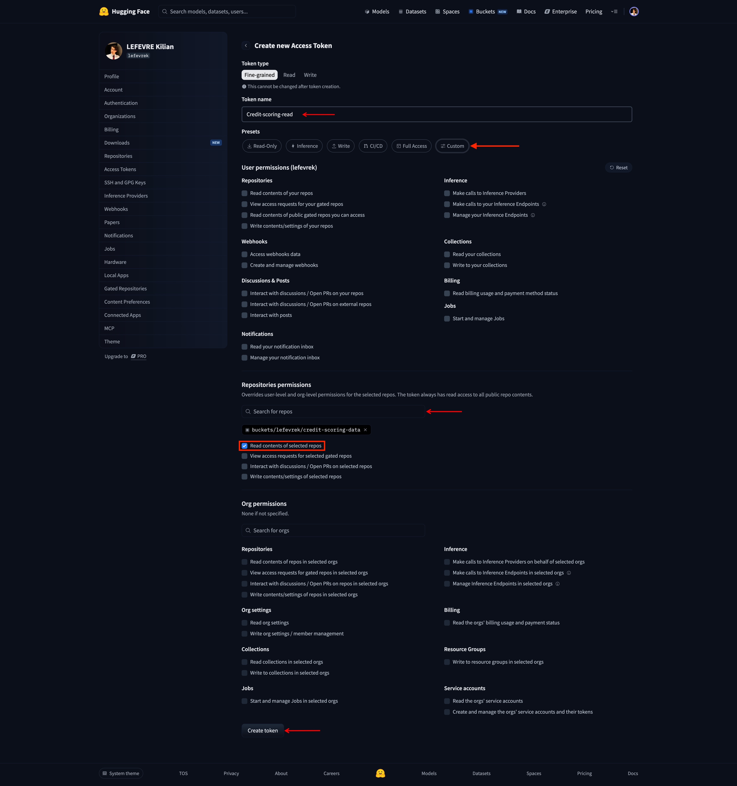
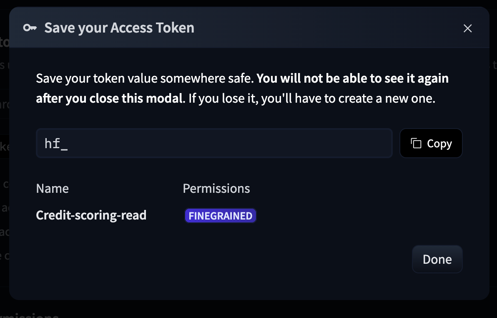

# Configurer le bucket Hugging Face

Le jeu de référence utilisé pour la détection de drift (`serving_50_features.parquet`, voir [Analyse du drift](../../operations/drift-analysis.md)) est stocké dans un **bucket Hugging Face privé** — le produit "Storage Buckets" du Hub (objet, non versionné, distinct des repos de dataset classiques), pas un espace HF Spaces. Étapes ci-dessous dans l'ordre réellement suivi, captures à l'appui.

## 1. Créer le bucket

Depuis le menu profil du Hub, **+ New Bucket** :



Formulaire de création : propriétaire, nom du bucket, et surtout **Private** (pas Public — seul le propriétaire doit pouvoir lire/écrire) :



Le nom donné ici est ce qui est stocké dans `HF_BUCKET_ID`. Alternative en CLI :

```bash
hf buckets create <nom-du-bucket> --private
```

## 2. Uploader le jeu de référence

Depuis le dépôt d'entraînement du modèle (hors périmètre de ce dépôt), publier `reduced/serving_50_features.parquet` dans le bucket — c'est le chemin exact attendu par `scripts/download_drift_reference.py` (`REMOTE_PATH = "reduced/serving_50_features.parquet"`).

## 3. Générer un token en lecture seule

Depuis la page du bucket, menu profil → **Access Tokens** :



**+ Create new token** :



Type **Fine-grained**, un nom explicite, puis dans les permissions du repo : chercher le bucket et cocher uniquement **Read contents of selected repos** — rien d'autre, ce script ne fait que télécharger :



Ce token devient `HF_BUCKET_READ_TOKEN` :



## 4. Où placer ces identifiants

| Variable | Où |
|---|---|
| `HF_BUCKET_ID` | `.env` local (optionnel, seulement si drift testé en local) + secret GitHub Actions `HF_BUCKET_ID` |
| `HF_BUCKET_READ_TOKEN` | secret GitHub Actions `HF_BUCKET_READ_TOKEN`, consommé par le workflow de rapport de drift (voir [CI/CD & déploiement](../../operations/deployment.md)) |

Jamais dans `deploy/.env` du VPS : le téléchargement du jeu de référence n'a lieu que dans le job CI drift, jamais dans l'API elle-même en production (même raison que le petit échantillon committé pour la démo plutôt que téléchargé au démarrage — voir [Démo Gradio](../../operations/demo.md)).

## 5. Vérifier

```bash
make download-drift-reference
```

Doit écrire `data/drift/reference/serving_50_features.parquet` sans erreur d'authentification.
