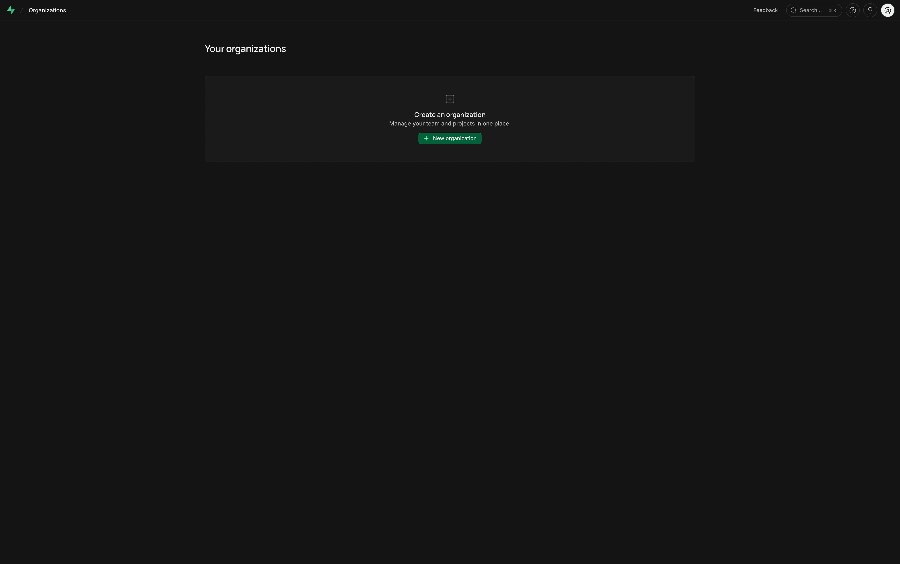
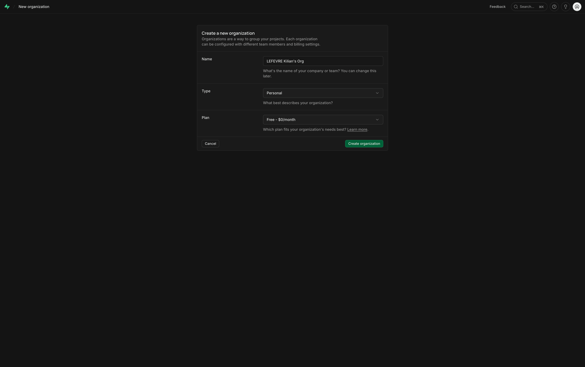
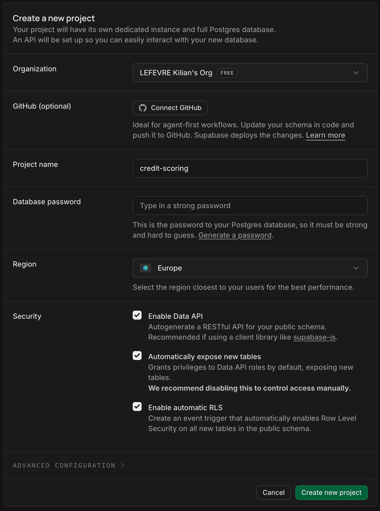
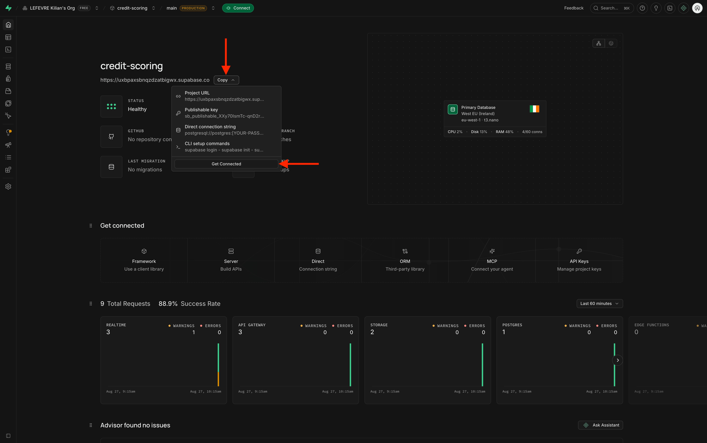
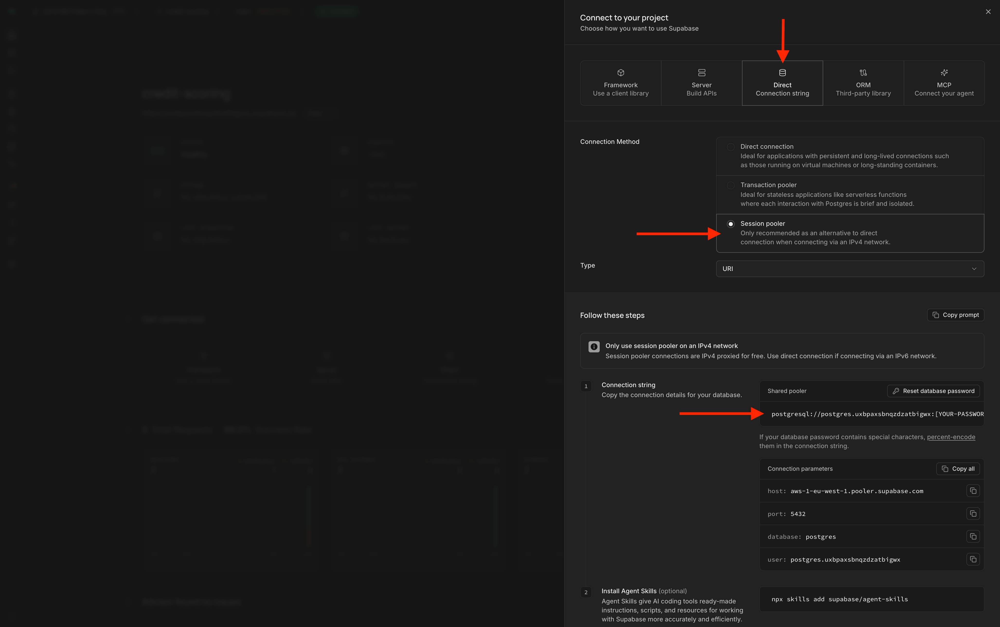
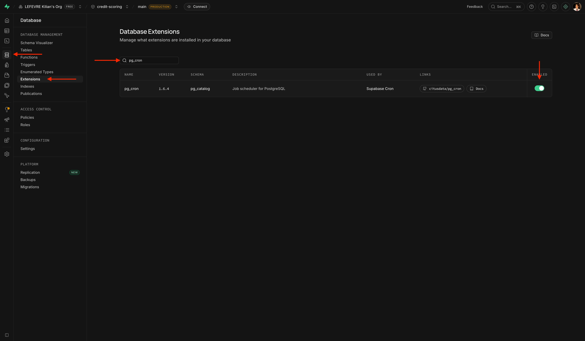
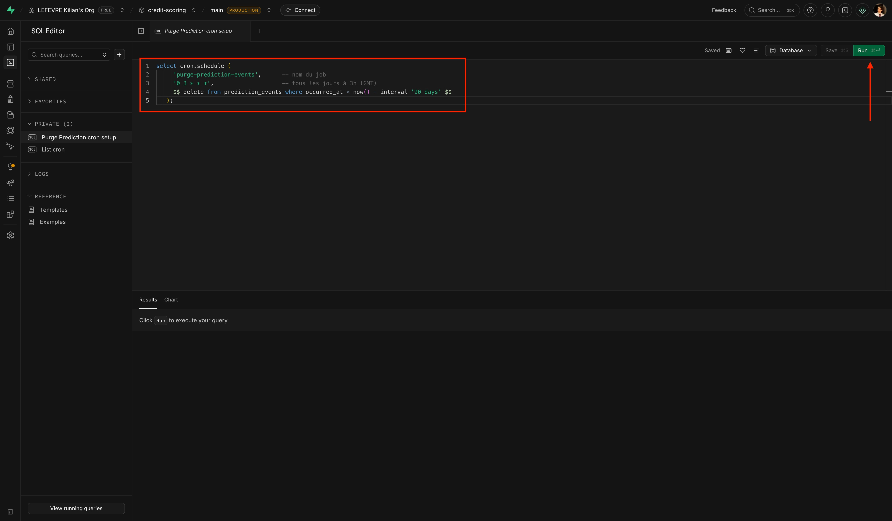
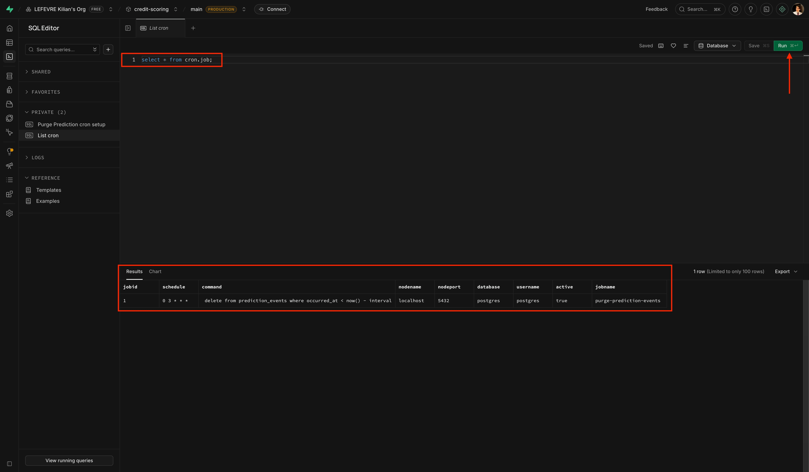

# Configurer Supabase

Supabase héberge PostgreSQL pour la persistance des prédictions (`prediction_events`, voir [Architecture](../../design/architecture.md)) — **un projet Supabase par environnement** (`release` et `production`), jamais partagé, contrairement au stack Grafana Cloud. Étapes ci-dessous dans l'ordre réellement suivi, captures à l'appui.

## 1. Créer un projet par environnement

Premier login : aucune organisation encore créée.



Formulaire de création d'organisation (nom, type, plan — Free suffit pour ce volume) :



Puis un projet par environnement (nom, mot de passe — utiliser le lien "Generate a password" plutôt qu'en choisir un à la main et noter ce mot de passe (il pourra toujours être généré ultérieurement), région Europe, options de sécurité par défaut conservées) :



## 2. Récupérer la chaîne de connexion

Une fois le projet créé, sa page d'accueil propose directement les options de connexion (**Connect**, ou le menu **Copy** avec Project URL / clé / connection string) :



Dans le détail de connexion, choisir le mode **Session pooler** — pas Transaction pooler : le VPS s'y connecte en IPv4, et le session pooler proxy cette connexion gratuitement (le direct/transaction pooler nécessiteraient une IPv4 dédiée payante) :



Format exact déjà utilisé dans `deploy/.env.example` :

```
DATABASE_URL=postgresql://postgres.<project-ref>:<password>@aws-<region>.pooler.supabase.com:5432/postgres?sslmode=require
```

À placer dans `deploy/.env` sur le VPS, un par environnement (jamais commité — voir [CI/CD & déploiement](../../operations/deployment.md)). Les migrations Alembic (`alembic upgrade head`) tournent automatiquement au déploiement contre ce `DATABASE_URL`.

## 3. Rétention des données (`pg_cron`)

Une politique de purge automatique tourne quotidiennement sur chaque environnement — durée de rétention volontairement différente : courte en `release` (environnement de test), longue en `production` (utile pour le drift et l'audit — voir [Sécurité](../../design/security.md#retention-et-minimisation-des-donnees)).

Activer l'extension `pg_cron` dans **Database → Extensions** :



Puis, dans le **SQL Editor**, programmer la purge (exemple production, 90 jours — remplacer par `interval '2 days'` en release) :

!!! note
    Ne pas oublier de lancer la requête avec le bouton `Run` en haut à droite.

```sql
select cron.schedule(
  'purge-prediction-events',
  '0 3 * * *',
  $$ delete from prediction_events where occurred_at < now() - interval '90 days' $$
);
```



Le job tourne tous les jours à 3h (UTC), purge les lignes de `prediction_events` plus anciennes que la fenêtre de rétention.

## 4. Vérifier

```sql
select * from cron.job;
```



## 5. Connexion depuis l'API

Aucune configuration Supabase-spécifique côté application : `src/api/infra/postgres/tracking.py` se connecte comme à n'importe quel PostgreSQL via `DATABASE_URL` (SQLAlchemy). `GET /ready` (voir [Health & readiness](../../design/api/health.md)) vérifie activement cette connexion à chaque appel.
