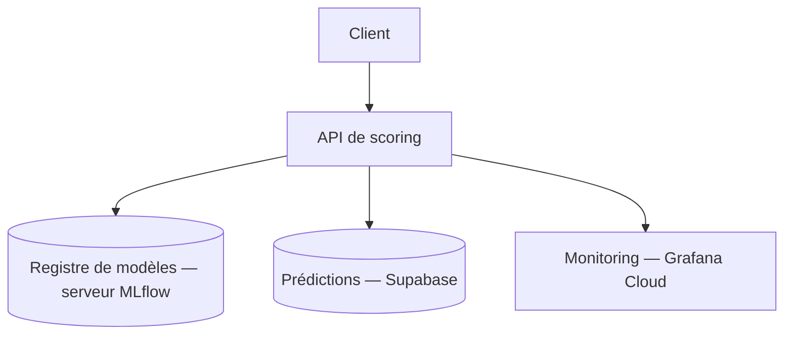

# Credit Scoring API

## Contexte

"Prêt à Dépenser" traite un volume croissant de demandes de crédit et a besoin d'un service de scoring automatisé, fiable et observable — pas seulement un modèle qui tourne dans un notebook. Ce dépôt livre la partie mise en production : une API qui expose le modèle de scoring, conteneurisée, déployée et monitorée en continu, avec une détection automatique de dérive des données. Le modèle lui-même (feature engineering, entraînement, registre MLflow) vit dans un dépôt séparé — celui-ci est le dépôt de **déploiement**.

**Périmètre et limites** :

- Le score renvoyé est une aide à la décision, pas une décision d'octroi automatique au sens réglementaire — voir [Contrat métier](design/model.md#contrat-metier).
- Aucune revue humaine n'est intégrée au flux applicatif lui-même — un éventuel circuit d'approbation humaine est externe à ce dépôt. Son rôle serait de tracer la décision réellement retenue (accord/refus final, éventuellement différent du score brut) pour enrichir le futur jeu d'entraînement sans y réinjecter les biais du modèle en place — éviter que le modèle n'apprenne, à terme, de ses propres décisions.

## Comment ça fonctionne, en surface

Un client envoie un dossier (50 features) à `POST /predictions`. L'API valide strictement l'entrée, interroge le modèle chargé en mémoire (téléchargé au démarrage depuis le serveur MLflow qui héberge le registre de modèles), compare le score obtenu à un seuil pour trancher accepté/refusé, puis persiste l'événement dans PostgreSQL avant de répondre. En parallèle, chaque requête alimente des métriques et des logs structurés, collectés en continu par un agent unique et visualisés dans Grafana — le détail complet (composants, orchestration CI/CD, flux de données) est dans [Architecture](design/architecture.md).



## Démarrage rapide

```bash
uv sync --extra api
make db-migrate
make run
```

Suppose une base PostgreSQL déjà lancée (par exemple `docker compose up -d postgres`) et les variables d'environnement déjà configurées (accès MLflow, Supabase...). `make db-migrate` applique les migrations sur cette base, puis `make run` démarre l'API en local avec uvicorn (`uvicorn api.main:app --reload`) — sans ces deux préalables, l'API démarre mais échoue au premier appel. Détails complets : [Installation & configuration](getting-started/configuration.md).

L'API écoute ensuite sur `http://localhost:8000` — documentation interactive Swagger sur `/docs`.

## Par thème

<div class="grid cards" markdown>

- **Démarrer**

    Installer les dépendances, configurer les variables d'environnement, lancer l'API en local ou via Docker, puis configurer Grafana Cloud, Supabase et le bucket Hugging Face.

    → [Installation & configuration](getting-started/configuration.md) · [Grafana Cloud](getting-started/services/grafana-cloud.md) · [Supabase](getting-started/services/supabase.md) · [Bucket Hugging Face](getting-started/services/huggingface-bucket.md)

- **Conception & sécurité**

    Architecture hexagonale, référence complète des endpoints HTTP, modèle de scoring servi, authentification et gestion des secrets.

    → [Architecture](design/architecture.md) · [Référence API](design/api/index.md) · [Modèle de scoring](design/model.md) · [Sécurité](design/security.md)

- **Utiliser le service**

    La démo Gradio pour tester sans écrire de code, le monitoring (métriques/logs/dashboards) pour voir ce qui se passe en continu, et la détection de dérive des données.

    → [Démo Gradio](operations/demo.md) · [Monitoring & métriques](operations/monitoring.md) · [Génération du trafic de drift](operations/drift-generation.md) · [Analyse du drift](operations/drift-analysis.md)

- **Livrer & valider**

    Pipeline CI/CD, environnements et topologie de déploiement VPS, pyramide de tests et qualité de code, optimisation des performances d'inférence.

    → [CI/CD & déploiement](operations/deployment.md) · [Tests & qualité](operations/testing.md) · [Optimisation d'inférence (ONNX)](operations/optimisation-inference.md)

</div>

## Ce que ce dépôt démontre concrètement

- **Stratégie de branches** — historique Git structuré, gitflow réel (`main`/`develop`/`release`/`feature`/`fix`/`hotfix`, voir [Modèle de branches](operations/deployment.md#modele-de-branches)).
- **API + conteneurisation + CI/CD automatisé** — 5 workflows GitHub Actions couvrant qualité, build, déploiement, drift et documentation (voir [CI/CD & déploiement](operations/deployment.md)).
- **Monitoring et observabilité** — métriques Prometheus, logs structurés, dashboards Grafana Cloud (voir [Monitoring](operations/monitoring.md)).
- **Détection de drift automatisée** — pipeline Evidently hebdomadaire, sans intervention manuelle (voir [Analyse du drift](operations/drift-analysis.md)).
- **Optimisation d'inférence mesurée** — profiling, conversion ONNX, gain ~19-21× confirmé en production sans régression (voir [Optimisation d'inférence (ONNX)](operations/optimisation-inference.md)).
