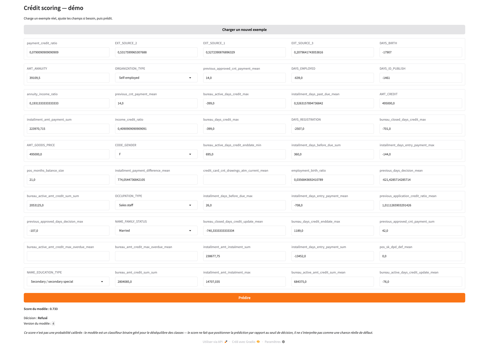
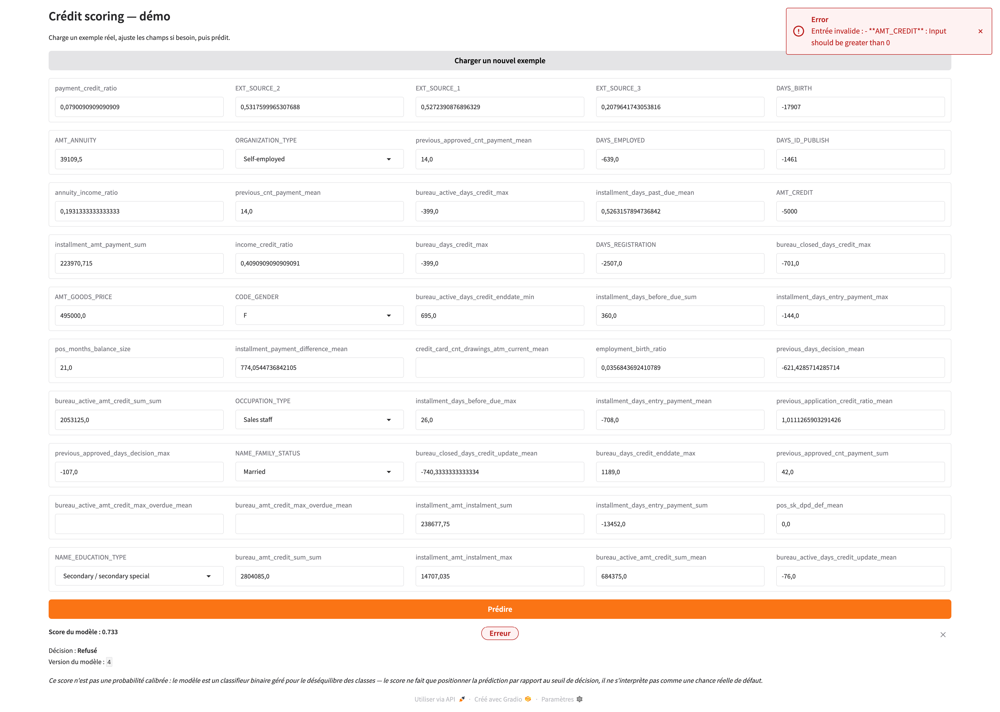

# Démo Gradio

Une interface Gradio est montée directement sur l'API, à la racine du service (`/`), pour tester le modèle sans passer par `curl` ou Postman — montée sur l'API plutôt que déployée comme un service séparé, par simplicité de déploiement (`gr.mount_gradio_app`, une seule image Docker, un seul processus à faire tourner). Ouverte sans authentification, pour que l'examinateur y accède sans configuration (voir [Sécurité](../design/security.md#authentification)).

Le clic sur "Prédire" envoie les valeurs du formulaire en HTTP à **`POST /predictions`** (`src/ui/blocks.py`) plutôt que d'appeler directement le use case de scoring : l'API reste ainsi l'unique frontière de validation, sans dupliquer les règles de `PredictionRequest` côté UI.

*Un exemple réel chargé, une prédiction affichée (score + décision). Le résultat s'appelle volontairement "Score du modèle", pas "probabilité" — voir [Scoring](../design/api/scoring.md#post-predictions) pour pourquoi ce chiffre n'a pas de signification probabiliste calibrée. Capturé en local, 26/08/2026.*

## Les champs du formulaire

Les 50 champs correspondent exactement à `PredictionRequest` — mêmes noms, mêmes bornes, voir [Scoring](../design/api/scoring.md#post-predictions) pour le détail plutôt que le redocumenter ici. Un bouton "Charger un nouvel exemple" tire une ligne au hasard dans un petit échantillon de données réelles committé dans le dépôt (`src/ui/sample_data/demo_samples.csv`) et pré-remplit le formulaire ; l'utilisateur peut ensuite éditer les valeurs avant de lancer la prédiction.

## Gestion des erreurs de saisie

Les composants Gradio ne valident rien par eux-mêmes — c'est `PredictionRequest(**valeurs)` côté API qui rejette une saisie invalide. L'erreur pydantic brute est retraduite en un message court, par champ fautif :

*Une valeur hors borne (`AMT_CREDIT` négatif) rejetée avec un message par champ, pas un dump technique. Capturé en local, 26/08/2026.*
