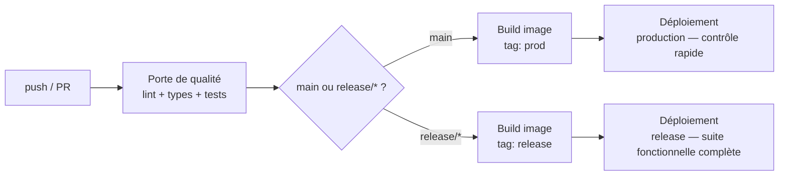
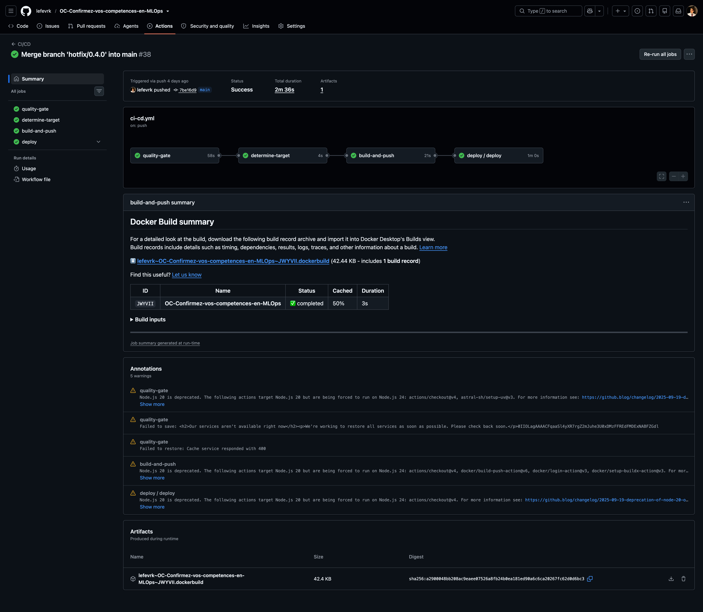
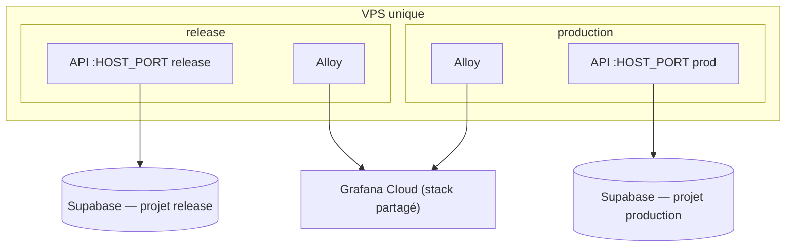
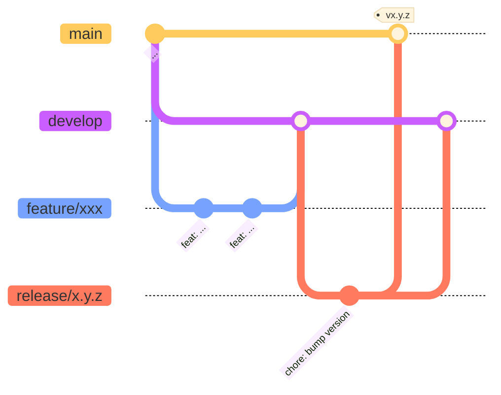

# CI/CD & déploiement

Livrer une nouvelle version sans y repenser à chaque fois — pas de checklist manuelle, pas de SSH à la main sauf en cas d'incident. GitHub Actions est l'orchestrateur central de tout ce qui n'est pas la vie courante d'une requête HTTP : lint/tests, build de l'image, déploiement, et les jobs périodiques (drift, documentation) — voir [Vue orchestration](../design/architecture.md#vue-orchestration-github-actions) pour la vue d'ensemble. Un seul VPS héberge deux environnements logiques, `release` et `production`.

L'idée simple : chaque push déclenche d'abord une porte de qualité (lint, types, tests) ; s'il atteint `main` ou une branche `release/*`, l'image est construite puis déployée automatiquement sur l'environnement correspondant, avec une vérification post-déploiement adaptée au risque (suite fonctionnelle complète en `release`, contrôle rapide en `production` puisque `release` a déjà validé la même image).



`determine-target` (l'étape qui choisit l'environnement) ne s'exécute que sur push/`workflow_dispatch` vers `main` ou `release/**` — jamais sur une simple PR, qui s'arrête après la porte de qualité.



*Une [exécution réelle et publique](https://github.com/lefevrk/OC-Confirmez-vos-competences-en-MLOps/actions/runs/32673881144), tous les jobs verts (`quality-gate`, `determine-target`, `build-and-push`, `deploy`). Ce que ça prouve : cette automatisation tourne réellement, pas seulement sur le papier.*

## Vue d'ensemble des pipelines

Le dépôt a exactement 5 workflows :

| Workflow | Fichier | Déclencheur | Rôle |
|---|---|---|---|
| Porte de qualité + build + déploiement | `ci-cd.yml` | push/PR sur `develop`/`main`/`release/**` | cette page |
| Déploiement | `deploy.yml` | appelé par `ci-cd.yml` | déploiement VPS + vérification post-déploiement |
| Surveillance drift | `drift-monitoring.yml` | cron hebdomadaire + manuel | déclenche l'analyse de drift |
| Rapport de drift | `drift-report.yml` | appelé par `drift-monitoring.yml` | génère, publie et archive le rapport de drift ([Analyse du drift](drift-analysis.md)) |
| Documentation | `docs.yml` | push sur `main` (`docs/**`) + manuel | build + publie ce site sur GitHub Pages |

## La porte de qualité

Sur chaque push et PR vers `develop`, `main` ou `release/**` :

```bash
uv sync --extra api --group drift
uv run ruff check . && uv run ruff format --check .
uv run pyright
uv run pytest --cov=api --cov-report=term-missing --cov-fail-under=80
```

`--group drift` est inclus car `scripts/` (analyse de drift) est lui-même linté/typé/testé comme le reste du code. Les tests d'intégration démarrent leur propre PostgreSQL éphémère via testcontainers — aucune base externe requise. Le rapport de couverture HTML est aussi archivé en artefact de l'exécution — voir [Tests & qualité](testing.md#rapport-de-couverture-en-ci).

## Build et déploiement

L'image Docker est construite (`Dockerfile`, build multi-stage `uv`) et poussée sur `ghcr.io/<org>/credit-scoring-api`, taguée par le SHA du commit et par le tag d'environnement (`prod` ou `release`). Le déploiement lui-même :

1. Synchronise `deploy/compose.yml` et `deploy/alloy/config.alloy` vers le VPS par SCP — ces deux fichiers sont la source de vérité unique de la topologie de déploiement, jamais édités à la main sur le serveur. Seul `.env` (secrets, `IMAGE_TAG`, `HOST_PORT`) reste local au VPS.
2. `docker compose pull && docker compose run --rm api alembic upgrade head && docker compose up -d`.
3. Attend que `/ready` réponde (`scripts/wait_for_ready.sh`).
4. Selon l'environnement : la suite fonctionnelle complète (`tests/functional/`) contre `release`, ou un simple contrôle de bon sens (`scripts/sanity_check.sh`) contre `production`.

## Documentation

Pipeline indépendant du reste, deux jobs : **build** (installe les dépendances, régénère [Modèle de scoring](../design/model.md) depuis le champion MLflow, puis `uv run mkdocs build --strict` — `--strict` fait échouer le build sur tout lien mort) et **deploy** (`actions/deploy-pages` publie le résultat). Déclenché sur push vers `main` touchant `docs/**`, ou manuellement.

## Topologie VPS

Un seul VPS héberge les deux environnements, chacun dans son propre répertoire de déploiement, avec son propre `.env`, son propre `HOST_PORT` et sa propre base Supabase :



Volume de trafic faible pour un projet de démonstration : un seul serveur suffit, avec deux répertoires de déploiement isolés plutôt que deux VPS séparés. Compromis assumé : pas d'isolation physique entre `release` et `production`. Les deux environnements partagent le **même** stack Grafana Cloud — distingués par un label `environment`, pas par une infrastructure de monitoring séparée (voir [Monitoring](monitoring.md)). Les bases Supabase, elles, sont bien deux projets séparés (voir [Configurer Supabase](../getting-started/services/supabase.md), y compris leurs politiques de rétention différentes).

## Modèle de branches

Gitflow classique, confirmé par l'historique réel du dépôt :



`main` (production), `develop` (intégration), `release/x.y.z` (préparation de release, mergé dans `main` **et** `develop`), `feature/*` (une fonctionnalité, mergé dans `develop`), `fix/*` (un correctif), `hotfix/x.y.z` (correctif urgent, mergé dans `main` **et** `develop` directement, sans passer par une branche `release/*`).

Ces branches sont éphémères — supprimées après merge, gitflow standard. Le diagramme reflète la convention réellement appliquée, visible dans l'historique des commits de merge (`git log --all --grep "Merge branch"`), pas dans la liste des branches vivantes à un instant donné (généralement réduite à `main` et `develop` entre deux cycles).

## Secrets & variables requis

Définis par environnement GitHub (`release`/`production`) :

| Nom | Type | Utilisé par | Rôle |
|---|---|---|---|
| `VPS_SSH_KEY` | secret | Déploiement, Rapport de drift | clé privée SSH pour se connecter au VPS |
| `VPS_USER` | secret | Déploiement, Rapport de drift | utilisateur SSH du VPS |
| `VPS_HOST` | secret | Déploiement, Rapport de drift | hôte du VPS |
| `VPS_PATH` | variable | Déploiement, Rapport de drift | répertoire de déploiement sur le VPS (par environnement) |
| `PUBLIC_URL` | variable | Déploiement | URL publique de l'environnement (readiness check, tests fonctionnels) |
| `DATABASE_URL` | secret | Rapport de drift | accès lecture à la base de l'environnement analysé |
| `HF_BUCKET_ID` / `HF_BUCKET_READ_TOKEN` | secrets | Rapport de drift | téléchargement du jeu de référence drift (voir [Configurer le bucket Hugging Face](../getting-started/services/huggingface-bucket.md)) |
| `MLFLOW_TRACKING_URI` / `_USERNAME` / `_PASSWORD` | secrets | Documentation | régénération de [Modèle de scoring](../design/model.md) depuis le champion MLflow |
| `GITHUB_TOKEN` | implicite (fourni par GitHub) | Porte de qualité + build | login `ghcr.io` pour le push d'image |

Se créent dans **Settings → Secrets and variables → Actions** du dépôt, sous l'onglet **Environments** pour les valeurs spécifiques à `release`/`production`. `API_TOKEN` (Basic sur `/evidently`) reste une variable locale/VPS — voir [Installation & configuration](../getting-started/configuration.md) — plus un secret GitHub Actions, `/predictions` et `/` n'en ayant plus besoin (voir [Sécurité](../design/security.md#authentification)).
