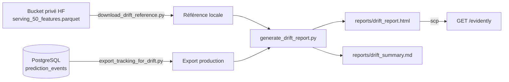
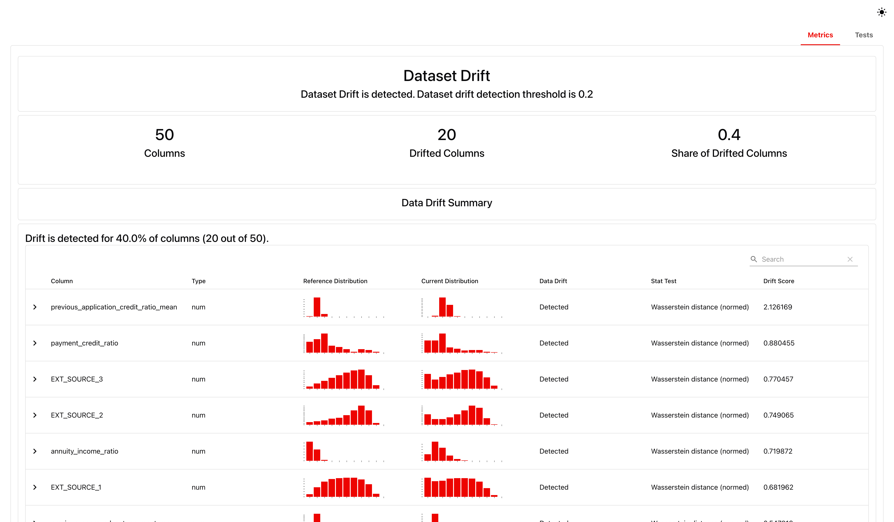
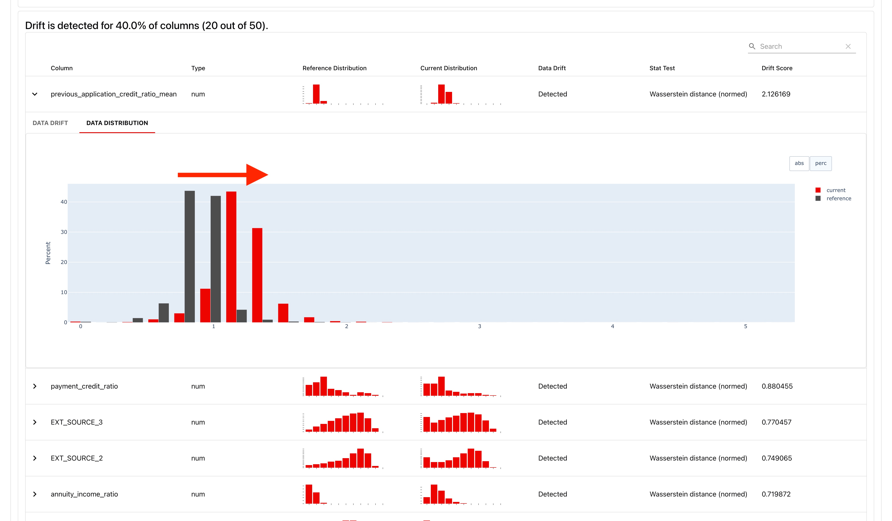
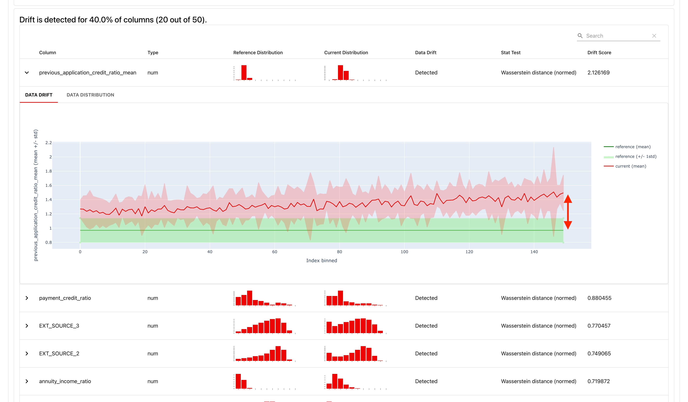

# Analyse du drift

Le drift, c'est simplement le fait que les données réellement envoyées à l'API s'éloignent, avec le temps, des données sur lesquelles le modèle a été entraîné — un changement de population de clients, une crise économique, une saisonnalité. Un modèle qui n'a jamais été réentraîné sur ces nouvelles données peut continuer à répondre avec assurance tout en devenant de moins en moins fiable, sans qu'aucune erreur ne le signale : ses prédictions restent syntaxiquement valides, juste de moins en moins pertinentes. D'où le besoin d'une détection dédiée, séparée du monitoring applicatif classique (qui ne voit que des codes HTTP et des latences, pas la pertinence statistique des prédictions).

L'idée simple : comparer, feature par feature, la distribution des prédictions récentes à celle du jeu d'entraînement, et déclencher un verdict si trop de features ont significativement bougé. Evidently AI porte ce calcul.

## Comment la détection fonctionne



- `scripts/download_drift_reference.py` télécharge le jeu de référence (`serving_50_features.parquet`, les mêmes 50 features que `PredictionRequest`) depuis un bucket de stockage privé, avec un token en lecture seule.
- `scripts/export_tracking_for_drift.py` exporte la table `prediction_events` (colonne `features` JSONB dépliée en colonnes plates) pour une période donnée.
- `scripts/drift_analysis.py` porte la logique Evidently : `dataset_drift_test` déclare un verdict "drift détecté" dès que la part de colonnes individuellement dérivées dépasse 20 % (`Share of Drifted Columns >= 0.20`) ; `drift_scores` détaille le score par feature ; un résumé de classification (taux de refus, score moyen) complète le tableau.
- `scripts/generate_drift_report.py` orchestre les deux exports et Evidently pour produire `reports/drift_report.html` (rapport complet) et `reports/drift_summary.md` (résumé, publié dans le step summary CI).
- `notebooks/data_drift.ipynb` — la même analyse, en version exploratoire.

## Automatisation

Une surveillance hebdomadaire déclenche un job réutilisable qui génère et publie le rapport, sans intervention manuelle : chaque jeudi à 3h UTC sur l'environnement de production, ou manuellement sur release ou production. Le job télécharge la référence, génère le rapport contre la base de l'environnement ciblé, publie le résumé dans le step summary GitHub Actions, dépose le HTML sur le VPS pour que `/evidently` le serve, **et joint le rapport complet en artefact téléchargeable de l'exécution** — détail des fichiers `.github/workflows/drift-monitoring.yml`/`drift-report.yml` dans [CI/CD & déploiement](deployment.md).

Le résumé markdown donne le verdict en un coup d'œil, par exemple :

```markdown
# Rapport de drift — local

Généré le 2026-08-23T20:35:59+00:00 — 5000 prédictions analysées.

**Verdict : DRIFT DÉTECTÉ** — Share of Drifted Columns: Actual value 0.400 >= 0.200

Taux de refus : 40.4% — score moyen prédit : 46.6%

## Top features en dérive

| feature | drift_score |
|---|---|
| previous_application_credit_ratio_mean | 2.125 |
| payment_credit_ratio | 0.878 |
| EXT_SOURCE_3 | 0.771 |
```

## Exposition du rapport

`GET /evidently` (`src/api/modules/monitoring/router.py`) sert le rapport HTML complet tel quel, protégé par HTTP Basic (voir [Sécurité](../design/security.md#authentification)) — `404` tant qu'aucun rapport n'a été généré.

## Le voir sur un vrai rapport

La fixture générée dans [Génération du trafic de drift](drift-generation.md) sert précisément à ça : produire un rapport dont on sait, par construction, qu'il *doit* détecter une dérive — pour vérifier que la détection fonctionne, pas juste qu'elle tourne sans erreur.



*Résumé en tête de rapport (`GET /evidently`) après rejeu du trafic dérivant : verdict "Dataset Drift is detected", 20 des 50 colonnes en dérive (seuil 0.2), et le détail par feature triée par score de dérive — `previous_application_credit_ratio_mean` en tête, cohérent avec l'exemple de résumé markdown ci-dessus.*



*Le détail par feature, onglet "Data Distribution" : la distribution de référence (gris) contre la distribution actuelle (rouge) sur `previous_application_credit_ratio_mean` — le décalage visible est exactement celui injecté par le scénario de récession, pas un artefact statistique.*



*Même feature, onglet "Data Drift" : la moyenne courante (rouge) s'écarte progressivement de la bande de référence (vert) au fil des payloads rejoués — la dérive progressive construite par `generate_drift_fixtures.py` est directement visible ici, pas seulement dans le verdict final.*
