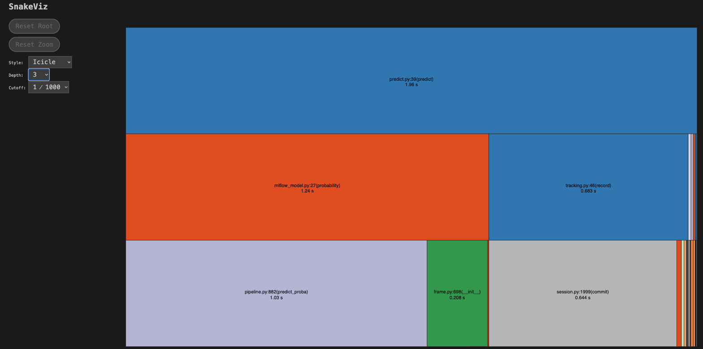
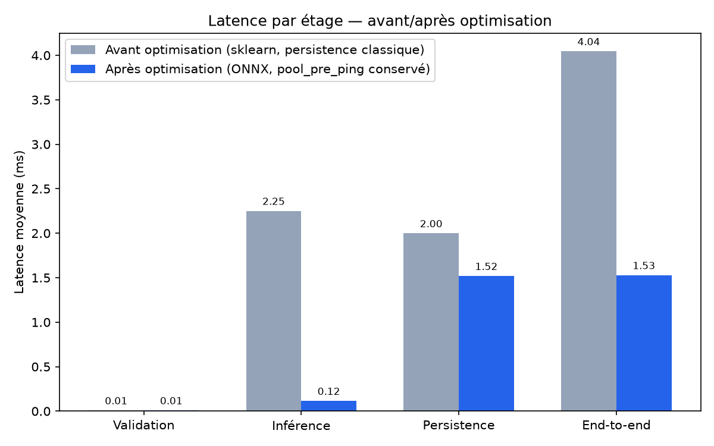
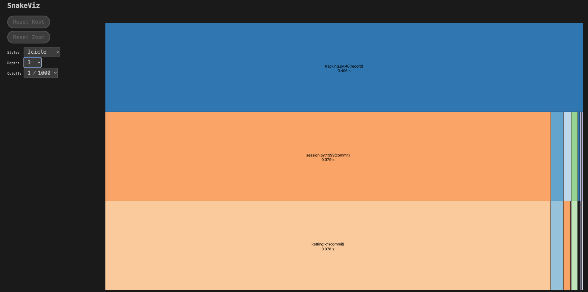
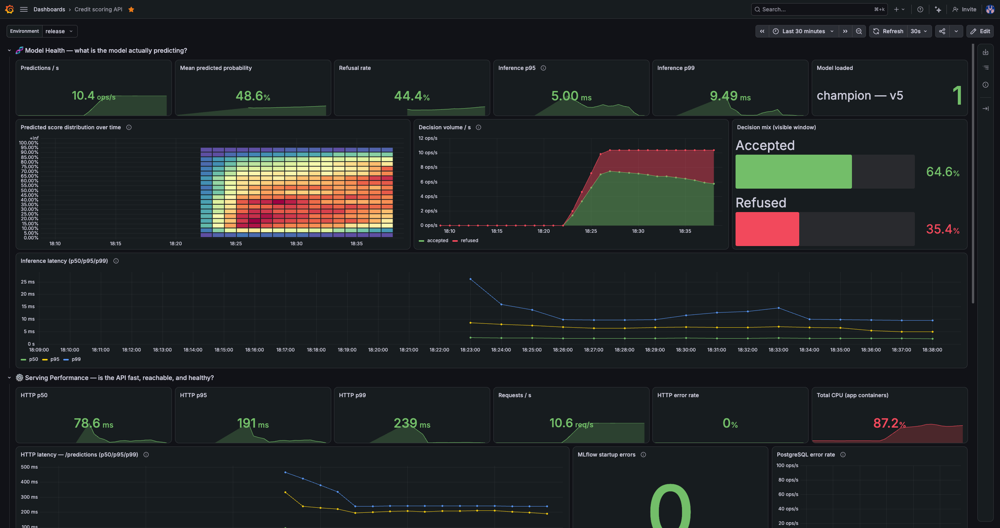

# Optimisation d'inférence (ONNX)

Étape 4 du cahier des charges : partir des données de monitoring réelles pour identifier un goulot d'étranglement, tester une stratégie d'optimisation, et prouver le gain sans régression. Contrainte du projet : la mécanique MLflow reste la source de vérité du modèle servi — pas de fichier modèle posé sur disque en dehors du registre, contrairement à une conversion ONNX qui bypasserait MLflow au moment du serving.

Ce dépôt ne fait pas l'entraînement ni la conversion (voir [Modèle de scoring](../design/model.md)) — la conversion ONNX et sa validation de non-régression ont été faites dans le dépôt d'entraînement, d'abord enregistrées sous l'alias `challenger` (registre `credit_scoring`) pour comparaison, comme décrit ci-dessous. **Après validation, ce modèle ONNX a été promu sur l'alias `champion`** ; l'ancien champion sklearn reste accessible sous l'alias `sklearn-champion` (rollback possible en un `MODEL_ALIAS=sklearn-champion` + redéploiement, sans changement de code — voir [Modèle de scoring](../design/model.md)).

## Goulot identifié

Mesuré en local avec `scripts/profiling/profile_predict.py` (voir [Tests & qualité](testing.md) pour le lancer), 200 appels contre le modèle alors champion — sklearn v4, aujourd'hui accessible sous l'alias `sklearn-champion` :

| Étage | Moyenne | Part du temps atomique |
|---|---|---|
| `validation` (Pydantic) | 0.009 ms | négligeable |
| `inference` (`model.probability`) | 2.251 ms | 53 % |
| `persistence` (écriture Postgres) | 1.999 ms | 47 % |

Le détail fonction par fonction (`cProfile`, voir le `.prof` du même run) montre que `inference` n'est pas dominé par le calcul LightGBM lui-même, mais par le **preprocessing scikit-learn** (`ColumnTransformer.transform`) et un **overhead `joblib.parallel`** — la pipeline sklearn dispatche son travail en parallèle même pour une seule ligne à la fois, ce qui est du pur overhead dans ce contexte de scoring unitaire.



*`uv run snakeviz reports/profiling/baseline-sklearn_predict.prof`, vue icicle limitée à 3 niveaux. `predict()` (1.96 s cumulées sur 200 appels) se scinde presque à parts égales entre `mlflow_model.py:27(probability)` (1.24 s) et `tracking.py:46(record)` (0.683 s) — visuellement, la moitié gauche confirme le tableau ci-dessus. Un niveau plus bas, `probability` passe déjà par `pipeline.py:882(predict_proba)` (1.03 s) : la quasi-totalité du temps d'inférence est déjà dans la pipeline sklearn avant même d'atteindre le modèle LightGBM lui-même.*

## Stratégie retenue

Conversion du pipeline (preprocessing + LightGBM) en un graphe ONNX unique dans le dépôt d'entraînement, ce qui élimine précisément ce dispatch Python/joblib par appel. Côté serving, `src/api/infra/mlflow_model.py` charge ce graphe **directement via `onnxruntime`** plutôt que par `mlflow.pyfunc.load_model` générique — le wrapper `pyfunc` intégré de `mlflow.onnx` ne marshalle pas correctement un graphe à 50 entrées nommées séparément et de types mixtes (float/string), reproduit et documenté lors de l'implémentation.

Compromis assumé : `mlflow_model.py` n'est plus totalement agnostique du format de modèle (il sait qu'il charge un graphe ONNX). La résolution par alias MLflow, le téléchargement et la validation du `threshold.json` restent inchangés — seul le format du fichier modèle chargé a changé. C'est justement ce qui rend la promotion (`challenger` → `champion`) transparente pour ce dépôt : aucun changement de code n'a été nécessaire, seul l'alias MLflow a été redirigé côté dépôt d'entraînement.

## Validation de non-régression

Comparaison entre l'ancien champion (v4, sklearn — alias `sklearn-champion` depuis la promotion) et le candidat ONNX (v5, alias `champion` depuis la promotion) sur le même jeu de test, au même seuil de décision (0.53), faite dans le dépôt d'entraînement :

| Métrique | `sklearn-champion` (v4) | `champion` (v5, ONNX) | Écart |
|---|:---:|:---:|:---:|
| ROC-AUC | 0.7804 | 0.7804 | -7.8e-07 |
| Log loss | 0.5256 | 0.5256 | +1.3e-06 |
| Precision | 0.1977 | 0.1977 | +0 |
| Recall | 0.6528 | 0.6528 | +0 |
| F1 | 0.3035 | 0.3035 | +0 |
| Coût métier | 0.4942 | 0.4942 | +0 |

Écart de probabilité prédite entre les deux modèles, ligne par ligne sur le jeu de test : écart moyen `7.2e-07`, écart maximal `0.0172` (arrondi de précision flottante lié à la conversion, sans effet sur la décision au seuil 0.53).

## Résultat mesuré

Même protocole de profiling, 200 appels, avant tout changement vs. état actuellement déployé :



*Généré par `make plot-profile-comparison` à partir de deux runs `scripts/profiling/profile_predict.py` (`reports/profiling/baseline-sklearn_stats.json` et `baseline-preping_stats.json`, non commités) — respectivement `sklearn-champion` (v4) avant tout changement, et `champion` (v5, ONNX).*

| Étage | Avant (sklearn) | Après (ONNX) | Gain |
|---|:---:|:---:|:---:|
| `inference` | 2.251 ms | 0.088–0.266 ms selon le run | **~8.5 à 25×** plus rapide (conversion ONNX) |
| `persistence` | 1.999 ms | 1.519 ms | **~1.3×** plus rapide — probablement de la variance entre runs distincts plutôt qu'un vrai gain (`persistence` dépend de Postgres, pas du format du modèle) |
| `end_to_end` | 4.045 ms | 1.529 ms | **~2.6×** plus rapide |
| **Goulot dominant** | `inference` (53 %) | `persistence` (92 %) | le modèle n'est plus le facteur limitant |

L'inférence n'est plus un facteur significatif de la latence de `/predictions` — la persistance PostgreSQL devient de très loin le poste dominant, malgré son propre gain. C'est un **second goulot, indépendant du modèle**, hors scope de la conversion ONNX (voir [Monitoring & métriques](monitoring.md) pour comment il est surveillé).

### Piste identifiée pour `persistence`, non implémentée

Le coût dominant (`session.commit()`, ~400 appels `psycopg2.cursor.execute` pour 200 prédictions dans le profil) est un aller-retour réseau + commit synchrone **par ligne**, payé en plein par le client puisque `create_prediction` (`router.py`) attend `recorder.record()` avant de répondre.

Le levier le plus direct serait de sortir cet appel du chemin critique avec `fastapi.BackgroundTasks` : la tâche s'exécute après l'envoi de la réponse, donc le client ne paie plus ce coût dans sa latence perçue — sans changer le débit ni la charge réelle sur Postgres.

**Non retenu pour l'instant** : ça affaiblit la garantie associée à une réponse `200` — elle ne signifierait plus « la prédiction est déjà persistée », seulement « le modèle a scoré ». En cas de crash du process entre l'envoi de la réponse et l'exécution de la tâche en arrière-plan, l'événement serait silencieusement perdu, ce qui va à l'encontre du point de vigilance de l'Étape 4 (« assurez-vous que les optimisations n'introduisent pas de régressions ») — ici, une régression de durabilité plutôt que de précision du modèle, mais une régression tout de même. À reconsidérer seulement si une garantie de rattrapage est ajoutée en parallèle (ex. file d'attente durable, retry avec dead-letter) — hors scope de ce travail d'optimisation modèle.



*`uv run snakeviz reports/profiling/challenger-onnx_predict.prof`, même vue, 3 niveaux. Contraste direct avec la capture précédente : `tracking.py:46(record)` (0.406 s) occupe maintenant la totalité du graphe visible — `mlflow_model.py:27(probability)` n'apparaît même plus dans les trois premiers niveaux, sa part étant devenue trop petite pour être visuellement distincte de `record()`. La table de stats en bas de page snakeviz confirme le chiffre : `onnxruntime_inference_collection.py:308(run)` ne cumule que 0.030 s sur les 200 appels, contre 0.379 s pour le seul `session.py:1999(commit)` Postgres.*

## Confirmation en production

Les deux comparaisons ci-dessus viennent d'un profiling local (`scripts/profiling/`). Le dashboard Grafana de l'environnement `release` donne le même avant/après, cette fois sur du trafic réel :

=== "Avant — `champion` v4 (sklearn)"

    

    *`Model loaded: champion — v4`. Inférence p95 = 94.7 ms, p99 = 200 ms.*

=== "Après — `champion` v5 (ONNX)"

    

    *`Model loaded: champion — v5`. Inférence p95 = 5.00 ms, p99 = 9.49 ms.*

| Métrique (`api-overview`, environnement `release`, ~10 req/s) | Avant (v4, sklearn) | Après (v5, ONNX) | Gain |
|---|:---:|:---:|:---:|
| Inférence p95 | 94.7 ms | 5.00 ms | **~19×** |
| Inférence p99 | 200 ms | 9.49 ms | **~21×** |
| HTTP `/predictions` p50 | 177 ms | 78.6 ms | ~2,3× |
| HTTP `/predictions` p95 | 372 ms | 191 ms | ~1,9× |
| HTTP `/predictions` p99 | 474 ms | 239 ms | ~2× |
| CPU total (conteneurs app) | 37.2 % | 87.2 % | ⚠️ +50 pts |

Les deux captures viennent de la même fenêtre de dashboard (30 dernières minutes), à un trafic comparable (9.56 vs 10.4 req/s) — le gain d'inférence (~19-21×) confirme en conditions réelles ce que montrait déjà le profiling local, et explique une bonne partie du gain sur la latence HTTP totale (le reste venant de `persistence`, le goulot désormais dominant identifié plus haut).

**Point à surveiller, non expliqué par ce travail** : le CPU des conteneurs applicatifs passe de 37 % à 87 % entre les deux captures. `onnxruntime` crée sa session sans réglage explicite de threads (voir [Stratégie retenue](#strategie-retenue) et `src/api/infra/mlflow_model.py`) — probablement plus de threads utilisés en parallèle pour aller plus vite, donc plus de CPU consommé pour une latence par requête plus basse. Pas un problème en soi (CPU encore loin de la saturation), mais à garder en tête avant d'augmenter significativement le trafic sans revisiter la configuration de threading `onnxruntime`.

## Reproduire

```bash
docker compose up -d postgres
make db-migrate

# Avant tout changement (sklearn, alias `sklearn-champion` depuis la promotion,
# et pool_pre_ping=True dans src/api/infra/postgres/tracking.py). Ce run n'est plus
# rejouable tel quel : mlflow_model.py ne sait plus charger qu'un graphe ONNX
# (voir Inference : stratégie retenue) — reports/profiling/baseline-sklearn_stats.json date
# d'avant ce refactor et est conservé tel quel comme référence historique.
MODEL_ALIAS=sklearn-champion SAMPLES=200 LABEL=baseline-sklearn make profile-predict
# État actuellement déployé (ONNX) — utilisé pour le snakeviz "goulot persistence" plus haut :
SAMPLES=200 LABEL=challenger-onnx make profile-predict
# Même config, run distinct utilisé pour le graphique combiné ci-dessus :
SAMPLES=200 LABEL=baseline-preping make profile-predict

# Graphique combiné (avant tout changement vs. état actuellement déployé) :
BASELINE=baseline-sklearn CHALLENGER=baseline-preping \
  BASELINE_NAME="Avant optimisation (sklearn, persistence classique)" \
  CHALLENGER_NAME="Après optimisation (ONNX)" \
  make plot-profile-comparison
```

Détail fonction par fonction d'un run : `uv run snakeviz reports/profiling/<label>_predict.prof`.
