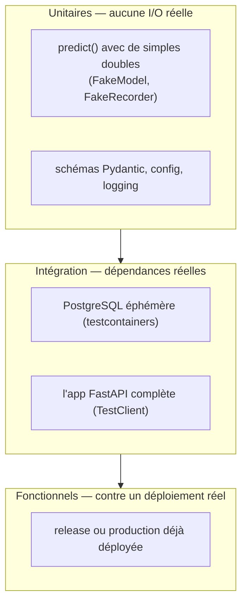

# Tests & qualité

Un changement ne doit pas pouvoir casser silencieusement le calcul d'un score ou la persistance d'une prédiction. L'idée simple : tester la logique métier isolément (rapide, aucune dépendance externe), puis les adaptateurs contre de vraies dépendances (une vraie base, une vraie app HTTP), et enfin l'API réellement déployée avant qu'un environnement plus critique ne reçoive la même image.



- **Unitaires** : aucune dépendance externe. `predict()` (`scoring/services/`) est testé avec de simples doubles (`FakeModel`, `FakeRecorder`) — voir `tests/unit/scoring/test_services.py`, repris à l'identique pour le formulaire Gradio (`tests/unit/demo/test_blocks.py`).
- **Intégration** : `tests/integration/conftest.py` démarre un conteneur PostgreSQL réel (`testcontainers`), le migre avec Alembic, et l'expose via `DATABASE_URL` — les tests qui touchent au stockage tournent contre une vraie base, jamais un mock.
- **Fonctionnels** : exécutés uniquement par le pipeline de déploiement, contre l'environnement `release` réellement déployé, avant que `production` ne reçoive la même image.

## Détail par fichier

88 fonctions de test réparties sur 16 fichiers (régénéré via `grep -c '^    def test_\|^def test_' <fichier>`) — `pytest` en collecte 102 au total, certaines de ces fonctions étant paramétrées en plusieurs cas :

| Fichier | Tests |
|---|---|
| `tests/integration/test_predictions.py` | 13 |
| `tests/unit/scoring/test_services.py` | 13 |
| `tests/unit/scripts/test_generate_drift_fixtures.py` | 10 |
| `tests/unit/scoring/test_schemas.py` | 10 |
| `tests/unit/test_logging.py` | 5 |
| `tests/integration/test_postgres_tracking.py` | 5 |
| `tests/integration/test_monitoring.py` | 5 |
| `tests/integration/test_api.py` | 5 |
| `tests/unit/test_config.py` | 4 |
| `tests/unit/scoring/test_mlflow_model.py` | 4 |
| `tests/unit/demo/test_blocks.py` | 4 |
| `tests/unit/common/test_error_handling.py` | 2 |
| `tests/integration/test_export_tracking_for_drift.py` | 2 |
| `tests/integration/test_drift_analysis.py` | 2 |
| `tests/integration/test_demo.py` | 2 |
| `tests/functional/test_live_api.py` | 2 |

## Lancer les tests

```bash
make test                                    # tests/unit + tests/integration
uv run pytest tests/functional/ -v           # nécessite une API déployée (API_BASE_URL)
uv run pytest --cov=api --cov-report=term-missing --cov-fail-under=80
```

Sortie réelle (pas une image — reste copiable, ne devient pas obsolète visuellement) :

```text
$ uv run pytest --cov=api --cov-report=term-missing --cov-fail-under=80
...
Required test coverage of 80% reached. Total coverage: 100.00%
102 passed, 10 warnings in 8.31s
```

## Rapport de couverture en CI

Le quality gate (voir [CI/CD & déploiement](deployment.md#le-quality-gate)) génère aussi un résumé markdown de la couverture (`coverage report --format=markdown`) — même logique que le rapport de drift : publié directement dans le step summary de l'exécution GitHub Actions, **et** joint en artefact téléchargeable, consultable après coup sans reparcourir les logs bruts du terminal.

## Qualité de code

- **Ruff** (`pyproject.toml [tool.ruff]`) — lint (`E`, `W`, `F`, `I`, `D`, `B`) et formatage, ligne à 100 caractères, docstrings au format Google.
- **Pyright** (`typeCheckingMode = "basic"`) sur `src/`, `tests/`, `scripts/`.
- **Couverture** — seuil minimum 80 % (`fail_under = 80`), la CI casse en dessous.
- **pre-commit** (`make setup-hooks`) — lint et format avant chaque commit, hooks avant chaque push.

Ces trois contrôles (lint, types, tests) forment le quality gate de la CI — voir [CI/CD & déploiement](deployment.md).
